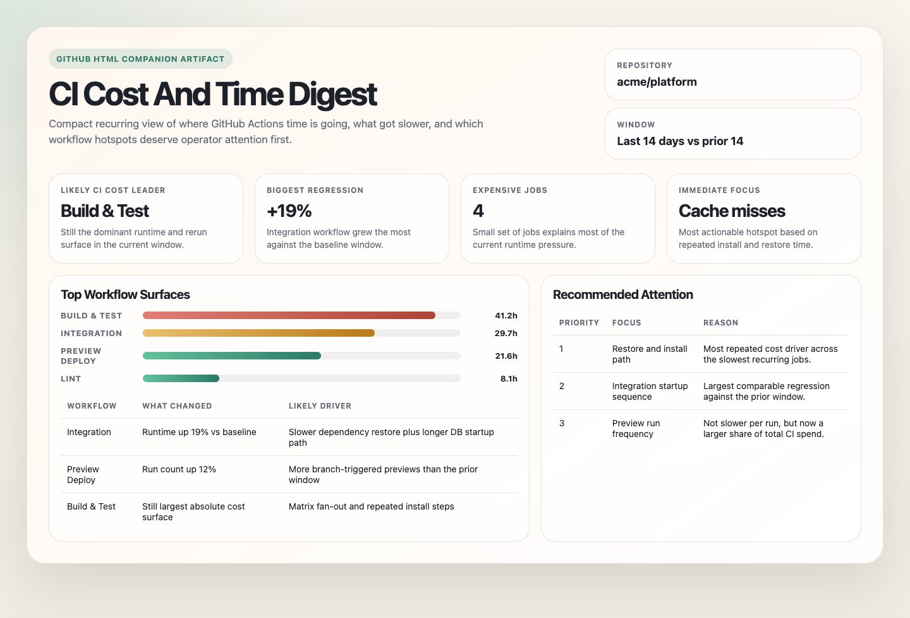

  <h1>AI Agent Automations</h1>
  
一个精选的、可直接运行的 AI Agent 自动化集合，面向真实世界的工作流。

  

    <a href="./README.md"><strong>English</strong></a>
     · 
    <a href="./README.zh-CN.md"><strong>简体中文</strong></a>
  

  适用于多种 Agent 环境与工作流平台

  

  

## 这是什么

一个精选的、可直接运行的 AI Agent 自动化集合，面向真实世界的工作流。

每个自动化都包含结构化 Prompt 和配套 README。你可以直接运行，也可以根据自己的技术栈进行调整，或把它当作构建自己工作流的灵感来源。它们覆盖代码、收件箱、支持、账单、可观测性、研究、安全和团队运营等实际任务。

按分类浏览，选择一个工作流，然后根据你的工具、上下文和具体用例进行微调。

一些自动化除了结构化文本摘要之外，还可以生成更完整的报告产物。

<table>
  <tr>
    <td width="33%" align="center">
      
       
      GitHub Actions CI 简报
    </td>
    <td width="33%" align="center">
      
       
      加密市场研究简报
    </td>
    <td width="33%" align="center">
      
       
      Stripe 付款失败风险简报
    </td>
  </tr>
</table>

## 自动化

### 代码质量与维护

用于代码库清理、更安全的修复、聚焦式重构，以及周期性维护工作的自动化。

| 自动化 | 用途 | 作用面 | 链接 |
| --- | --- | --- | --- |
| [`branch-change-test-coverage`](./automations/branch-change-test-coverage/README.md) | 为近期分支或已合并变更补充最小且有意义的缺失测试。 | ![Repo][repo-badge] ![GitHub][github-badge] | [README](./automations/branch-change-test-coverage/README.md) · [Prompt](./automations/branch-change-test-coverage/branch-change-test-coverage.md) |
| [`critical-bug-fix-pr`](./automations/critical-bug-fix-pr/README.md) | 找出一个真实的关键回归问题，并准备最小且安全的修复 PR。 | ![Repo][repo-badge] ![GitHub][github-badge] | [README](./automations/critical-bug-fix-pr/README.md) · [Prompt](./automations/critical-bug-fix-pr/critical-bug-fix-pr.md) |
| [`dead-code-sweep`](./automations/dead-code-sweep/README.md) | 执行保守的死代码清理，并验证删除是否安全。 | ![Repo][repo-badge] | [README](./automations/dead-code-sweep/README.md) · [Prompt](./automations/dead-code-sweep/dead-code-sweep.md) |
| [`launchdarkly-feature-flag-cleanup`](./automations/launchdarkly-feature-flag-cleanup/README.md) | 移除过期的临时功能开关代码，并验证变更。 | ![Repo][repo-badge] ![LaunchDarkly][launchdarkly-badge] | [README](./automations/launchdarkly-feature-flag-cleanup/README.md) · [Prompt](./automations/launchdarkly-feature-flag-cleanup/launchdarkly-feature-flag-cleanup.md) |
| [`sampled-refactor`](./automations/sampled-refactor/README.md) | 从代码库的随机片段中执行一个小型、保持行为不变的重构。 | ![Repo][repo-badge] ![GitHub][github-badge] | [README](./automations/sampled-refactor/README.md) · [Prompt](./automations/sampled-refactor/sampled-refactor.md) |

### 开发者工作流

用于 PR 路由、CI 可见性，以及周期性开发者工作流优化的自动化。

| 自动化 | 用途 | 作用面 | 链接 |
| --- | --- | --- | --- |
| [`github-actions-ci-cost-and-time-digest`](./automations/github-actions-ci-cost-and-time-digest/README.md) | 找出最消耗 CI 时间和成本的 workflow 与 job。 | ![GitHub][github-badge] ![GitHub Actions][github-actions-badge] | [README](./automations/github-actions-ci-cost-and-time-digest/README.md) · [Prompt](./automations/github-actions-ci-cost-and-time-digest/github-actions-ci-cost-and-time-digest.md) |
| [`github-ci-speedup-optimizer`](./automations/github-ci-speedup-optimizer/README.md) | 测试一个安全的 CI 加速改动，并报告它是否真的有效。 | ![GitHub][github-badge] ![GitHub Actions][github-actions-badge] ![Repo][repo-badge] | [README](./automations/github-ci-speedup-optimizer/README.md) · [Prompt](./automations/github-ci-speedup-optimizer/github-ci-speedup-optimizer.md) |
| [`github-pr-review-router`](./automations/github-pr-review-router/README.md) | 按真实阻塞状态整理开放 PR，而不是把整个队列当成一个桶。 | ![GitHub][github-badge] | [README](./automations/github-pr-review-router/README.md) · [Prompt](./automations/github-pr-review-router/github-pr-review-router.md) |

### 安全与合规

用于代码库、依赖、Atlas 配置以及外部安全信号审查的自动化。

| 自动化 | 用途 | 作用面 | 链接 |
| --- | --- | --- | --- |
| [`atlas-security-posture-digest`](./automations/atlas-security-posture-digest/README.md) | 审计 Atlas 网络、访问、备份与告警姿态。 | ![MongoDB][mongodb-badge] | [README](./automations/atlas-security-posture-digest/README.md) · [Prompt](./automations/atlas-security-posture-digest/atlas-security-posture-digest.md) |
| [`brand-typosquat-monitor`](./automations/brand-typosquat-monitor/README.md) | 监控围绕受保护品牌或域名家族的疑似仿冒域名。 | ![Public Web][web-badge] | [README](./automations/brand-typosquat-monitor/README.md) · [Prompt](./automations/brand-typosquat-monitor/brand-typosquat-monitor.md) |
| [`cisa-kev-relevance-digest`](./automations/cisa-kev-relevance-digest/README.md) | 将新近相关的 CISA KEV 条目映射到当前代码库中的真实信号。 | ![Public Web][web-badge] ![Repo][repo-badge] | [README](./automations/cisa-kev-relevance-digest/README.md) · [Prompt](./automations/cisa-kev-relevance-digest/cisa-kev-relevance-digest.md) |
| [`dependency-vulnerability-autofix`](./automations/dependency-vulnerability-autofix/README.md) | 修复一个已验证的依赖漏洞，并通过验证与可审查性门槛。 | ![Repo][repo-badge] ![GitHub][github-badge] | [README](./automations/dependency-vulnerability-autofix/README.md) · [Prompt](./automations/dependency-vulnerability-autofix/dependency-vulnerability-autofix.md) |
| [`license-compliance-drift-digest`](./automations/license-compliance-drift-digest/README.md) | 跟踪最可能需要关注的依赖许可证变化。 | ![Repo][repo-badge] | [README](./automations/license-compliance-drift-digest/README.md) · [Prompt](./automations/license-compliance-drift-digest/license-compliance-drift-digest.md) |
| [`scan-codebase-vulnerabilities`](./automations/scan-codebase-vulnerabilities/README.md) | 在代码库中找出已验证、可被利用的应用漏洞。 | ![Repo][repo-badge] | [README](./automations/scan-codebase-vulnerabilities/README.md) · [Prompt](./automations/scan-codebase-vulnerabilities/scan-codebase-vulnerabilities.md) |

### 本地安全

用于本地主机持久化检查、防火墙审查、网络巡检，以及工作站安全监控的自动化。

| 自动化 | 用途 | 作用面 | 链接 |
| --- | --- | --- | --- |
| [`launchagent-launchdaemon-evidence-pack`](./automations/launchagent-launchdaemon-evidence-pack/README.md) | 审查 macOS `launchd` 持久化面中值得人工调查的证据。 | ![Local Host][local-badge] | [README](./automations/launchagent-launchdaemon-evidence-pack/README.md) · [Prompt](./automations/launchagent-launchdaemon-evidence-pack/launchagent-launchdaemon-evidence-pack.md) |
| [`local-listening-service-and-firewall-audit`](./automations/local-listening-service-and-firewall-audit/README.md) | 审计暴露的本地服务和主机防火墙状态。 | ![Local Host][local-badge] | [README](./automations/local-listening-service-and-firewall-audit/README.md) · [Prompt](./automations/local-listening-service-and-firewall-audit/local-listening-service-and-firewall-audit.md) |
| [`local-network-monitor`](./automations/local-network-monitor/README.md) | 用证据和置信度说明总结当前主机网络状态。 | ![Local Host][local-badge] | [README](./automations/local-network-monitor/README.md) · [Prompt](./automations/local-network-monitor/local-network-monitor.md) |
| [`local-security-monitor`](./automations/local-security-monitor/README.md) | 执行一次有范围限制的本地主机安全姿态审查。 | ![Local Host][local-badge] | [README](./automations/local-security-monitor/README.md) · [Prompt](./automations/local-security-monitor/local-security-monitor.md) |
| [`shell-history-anomaly-digest`](./automations/shell-history-anomaly-digest/README.md) | 标记异常或与安全相关的 shell 历史模式，供进一步审查。 | ![Local Host][local-badge] | [README](./automations/shell-history-anomaly-digest/README.md) · [Prompt](./automations/shell-history-anomaly-digest/shell-history-anomaly-digest.md) |

### 可观测性与事故响应

用于由线上信号驱动的生产错误分诊、延迟调查，以及工程跟进的自动化。

| 自动化 | 用途 | 作用面 | 链接 |
| --- | --- | --- | --- |
| [`new-relic-error-fixer`](./automations/new-relic-error-fixer/README.md) | 在代码库侧路径安全时，修复一个高信号生产错误。 | ![New Relic][newrelic-badge] ![Repo][repo-badge] | [README](./automations/new-relic-error-fixer/README.md) · [Prompt](./automations/new-relic-error-fixer/new-relic-error-fixer.md) |
| [`new-relic-latency-hotspot-fixer`](./automations/new-relic-latency-hotspot-fixer/README.md) | 定位一个延迟热点，并在有充分理由时准备一个窄范围修复。 | ![New Relic][newrelic-badge] ![Repo][repo-badge] | [README](./automations/new-relic-latency-hotspot-fixer/README.md) · [Prompt](./automations/new-relic-latency-hotspot-fixer/new-relic-latency-hotspot-fixer.md) |
| [`sentry-slack-triage-digest`](./automations/sentry-slack-triage-digest/README.md) | 向 Slack 发布一份排序后的 Sentry 分诊简报，供人工审阅。 | ![Sentry][sentry-badge] ![Slack][slack-badge] | [README](./automations/sentry-slack-triage-digest/README.md) · [Prompt](./automations/sentry-slack-triage-digest/sentry-slack-triage-digest.md) |
| [`sentry-triage-and-fix`](./automations/sentry-triage-and-fix/README.md) | 修复一个高可信 Sentry 问题候选，而不是批量分诊所有问题。 | ![Sentry][sentry-badge] ![Repo][repo-badge] | [README](./automations/sentry-triage-and-fix/README.md) · [Prompt](./automations/sentry-triage-and-fix/sentry-triage-and-fix.md) |
| [`slack-engineering-signal-digest`](./automations/slack-engineering-signal-digest/README.md) | 将 Slack 中高信号工程讨论提炼成一份简报。 | ![Slack][slack-badge] | [README](./automations/slack-engineering-signal-digest/README.md) · [Prompt](./automations/slack-engineering-signal-digest/slack-engineering-signal-digest.md) |

### 成本与性能

用于周期性成本审查、基础设施效率分析，以及性能优化机会发现的自动化。

| 自动化 | 用途 | 作用面 | 链接 |
| --- | --- | --- | --- |
| [`atlas-cost-optimization-digest`](./automations/atlas-cost-optimization-digest/README.md) | 报告一个 Atlas 项目中最有价值的成本节省机会。 | ![MongoDB][mongodb-badge] | [README](./automations/atlas-cost-optimization-digest/README.md) · [Prompt](./automations/atlas-cost-optimization-digest/atlas-cost-optimization-digest.md) |
| [`atlas-performance-advisor-digest-and-pr`](./automations/atlas-performance-advisor-digest-and-pr/README.md) | 审查 Atlas Advisor 信号，并可在安全时起草一个索引相关 PR。 | ![MongoDB][mongodb-badge] ![Repo][repo-badge] | [README](./automations/atlas-performance-advisor-digest-and-pr/README.md) · [Prompt](./automations/atlas-performance-advisor-digest-and-pr/atlas-performance-advisor-digest-and-pr.md) |
| [`new-relic-cost-and-ingest-hygiene-audit`](./automations/new-relic-cost-and-ingest-hygiene-audit/README.md) | 找出一个 New Relic 账户中最大的遥测成本和 ingest 浪费。 | ![New Relic][newrelic-badge] | [README](./automations/new-relic-cost-and-ingest-hygiene-audit/README.md) · [Prompt](./automations/new-relic-cost-and-ingest-hygiene-audit/new-relic-cost-and-ingest-hygiene-audit.md) |

### 数据库可靠性

用于 MongoDB 查询健康检查和生产数据契约漂移检测的自动化。

| 自动化 | 用途 | 作用面 | 链接 |
| --- | --- | --- | --- |
| [`mongodb-query-anti-pattern-scout`](./automations/mongodb-query-anti-pattern-scout/README.md) | 将 Atlas 证据与代码中的高风险 MongoDB 查询模式关联起来。 | ![MongoDB][mongodb-badge] ![Repo][repo-badge] | [README](./automations/mongodb-query-anti-pattern-scout/README.md) · [Prompt](./automations/mongodb-query-anti-pattern-scout/mongodb-query-anti-pattern-scout.md) |
| [`production-data-contract-change-watch`](./automations/production-data-contract-change-watch/README.md) | 将线上文档形状与代码库中隐含的数据契约进行对比。 | ![MongoDB][mongodb-badge] ![Repo][repo-badge] | [README](./automations/production-data-contract-change-watch/README.md) · [Prompt](./automations/production-data-contract-change-watch/production-data-contract-change-watch.md) |

### 收件箱与日历

用于收件箱分诊、会议回复草稿，以及已发送邮件跟进的自动化。

| 自动化 | 用途 | 作用面 | 链接 |
| --- | --- | --- | --- |
| [`gmail-inbox-triage`](./automations/gmail-inbox-triage/README.md) | 对未读收件箱邮件进行分类，并按策略归档低价值类别。 | ![Gmail][gmail-badge] | [README](./automations/gmail-inbox-triage/README.md) · [Prompt](./automations/gmail-inbox-triage/gmail-inbox-triage.md) |
| [`gmail-meeting-request-draft-assistant`](./automations/gmail-meeting-request-draft-assistant/README.md) | 检查日历可用时间，并在不直接创建事件的情况下起草会议回复。 | ![Gmail][gmail-badge] ![Calendar][calendar-badge] | [README](./automations/gmail-meeting-request-draft-assistant/README.md) · [Prompt](./automations/gmail-meeting-request-draft-assistant/gmail-meeting-request-draft-assistant.md) |
| [`gmail-sent-email-follow-up-watcher`](./automations/gmail-sent-email-follow-up-watcher/README.md) | 找出可能需要人工跟进的已发送邮件线程，并起草提醒。 | ![Gmail][gmail-badge] | [README](./automations/gmail-sent-email-follow-up-watcher/README.md) · [Prompt](./automations/gmail-sent-email-follow-up-watcher/gmail-sent-email-follow-up-watcher.md) |

### 研究与趋势

用于周期性市场、生态、newsletter 和机器学习研究简报的自动化。

| 自动化 | 用途 | 作用面 | 链接 |
| --- | --- | --- | --- |
| [`crypto-market-research-digest`](./automations/crypto-market-research-digest/README.md) | 构建覆盖加密市场、DeFi、SEC 和 OFAC 信号的每日公开市场简报。 | ![Public Web][web-badge] | [README](./automations/crypto-market-research-digest/README.md) · [Prompt](./automations/crypto-market-research-digest/crypto-market-research-digest.md) |
| [`github-trending-digest`](./automations/github-trending-digest/README.md) | 总结 GitHub Trending 的热门仓库，不自行编造新的排名。 | ![GitHub][github-badge] ![Public Web][web-badge] | [README](./automations/github-trending-digest/README.md) · [Prompt](./automations/github-trending-digest/github-trending-digest.md) |
| [`gmail-newsletter-intel-brief`](./automations/gmail-newsletter-intel-brief/README.md) | 将 newsletter 噪音压缩成一份简洁、去重后的情报简报。 | ![Gmail][gmail-badge] ![Public Web][web-badge] | [README](./automations/gmail-newsletter-intel-brief/README.md) · [Prompt](./automations/gmail-newsletter-intel-brief/gmail-newsletter-intel-brief.md) |
| [`huggingface-model-digest`](./automations/huggingface-model-digest/README.md) | 将近期值得关注的 Hugging Face 模型总结成短简报。 | ![Hugging Face][huggingface-badge] | [README](./automations/huggingface-model-digest/README.md) · [Prompt](./automations/huggingface-model-digest/huggingface-model-digest.md) |
| [`huggingface-weekly-papers-digest`](./automations/huggingface-weekly-papers-digest/README.md) | 将近期 Hugging Face 论文动态整理成紧凑的周报。 | ![Hugging Face][huggingface-badge] | [README](./automations/huggingface-weekly-papers-digest/README.md) · [Prompt](./automations/huggingface-weekly-papers-digest/huggingface-weekly-papers-digest.md) |

### 客户成功

用于客户声音分析、续费风险识别，以及由支持信号驱动的文档改进自动化。

| 自动化 | 用途 | 作用面 | 链接 |
| --- | --- | --- | --- |
| [`plain-customer-voice-digest`](./automations/plain-customer-voice-digest/README.md) | 将近期支持对话聚类成有证据支撑的客户信号。 | ![Plain][plain-badge] | [README](./automations/plain-customer-voice-digest/README.md) · [Prompt](./automations/plain-customer-voice-digest/plain-customer-voice-digest.md) |
| [`plain-renewal-risk-digest`](./automations/plain-renewal-risk-digest/README.md) | 结合租户级上下文，标记由支持信号驱动的续费与流失风险。 | ![Plain][plain-badge] ![Stripe][stripe-badge] | [README](./automations/plain-renewal-risk-digest/README.md) · [Prompt](./automations/plain-renewal-risk-digest/plain-renewal-risk-digest.md) |
| [`support-docs-gap-drafter`](./automations/support-docs-gap-drafter/README.md) | 根据重复出现的支持问题，起草一个小型文档改进。 | ![Docs][docs-badge] ![Repo][repo-badge] | [README](./automations/support-docs-gap-drafter/README.md) · [Prompt](./automations/support-docs-gap-drafter/support-docs-gap-drafter.md) |

### 营收与账单

用于账单邮件整理、订阅风险审查、付款恢复，以及 Stripe 运营健康检查的自动化。

| 自动化 | 用途 | 作用面 | 链接 |
| --- | --- | --- | --- |
| [`gmail-billing-organizer`](./automations/gmail-billing-organizer/README.md) | 为发票、收据、续费和付款邮件打标签并生成摘要。 | ![Gmail][gmail-badge] | [README](./automations/gmail-billing-organizer/README.md) · [Prompt](./automations/gmail-billing-organizer/gmail-billing-organizer.md) |
| [`stripe-cancel-at-period-end-watch`](./automations/stripe-cancel-at-period-end-watch/README.md) | 对设置为周期结束取消的订阅进行排序，找出最值得挽留的客户。 | ![Stripe][stripe-badge] | [README](./automations/stripe-cancel-at-period-end-watch/README.md) · [Prompt](./automations/stripe-cancel-at-period-end-watch/stripe-cancel-at-period-end-watch.md) |
| [`stripe-failed-payment-risk-digest`](./automations/stripe-failed-payment-risk-digest/README.md) | 找出最可能造成流失或现金风险的付款失败情况。 | ![Stripe][stripe-badge] | [README](./automations/stripe-failed-payment-risk-digest/README.md) · [Prompt](./automations/stripe-failed-payment-risk-digest/stripe-failed-payment-risk-digest.md) |
| [`stripe-webhook-health-watch`](./automations/stripe-webhook-health-watch/README.md) | 审计线上 webhook 投递健康状况与生产端点配置问题。 | ![Stripe][stripe-badge] | [README](./automations/stripe-webhook-health-watch/README.md) · [Prompt](./automations/stripe-webhook-health-watch/stripe-webhook-health-watch.md) |

### 市场营销

用于将已交付的工程工作转化为产品传播文案的自动化。

| 自动化 | 用途 | 作用面 | 链接 |
| --- | --- | --- | --- |
| [`backlink-opportunity-finder`](./automations/backlink-opportunity-finder/README.md) | 查找未链接的品牌提及，草拟礼貌的 Gmail 外联，并记录已经处理过的机会。 | ![Public Web][web-badge] ![Gmail][gmail-badge] | [README](./automations/backlink-opportunity-finder/README.md) · [Prompt](./automations/backlink-opportunity-finder/backlink-opportunity-finder.md) |
| [`github-product-post-drafts`](./automations/github-product-post-drafts/README.md) | 将已发布的 GitHub 工作转成面向产品传播的帖文草稿。 | ![GitHub][github-badge] | [README](./automations/github-product-post-drafts/README.md) · [Prompt](./automations/github-product-post-drafts/github-product-post-drafts.md) |

### 工作分诊

用于在积压系统中创建、路由、同步或优先排序后续工程工作的自动化。

| 自动化 | 用途 | 作用面 | 链接 |
| --- | --- | --- | --- |
| [`dependency-major-upgrade-planner`](./automations/dependency-major-upgrade-planner/README.md) | 将高可信的主版本升级工作转成具体的 Linear 迁移任务。 | ![Repo][repo-badge] ![Linear][linear-badge] | [README](./automations/dependency-major-upgrade-planner/README.md) · [Prompt](./automations/dependency-major-upgrade-planner/dependency-major-upgrade-planner.md) |
| [`linear-triage-router`](./automations/linear-triage-router/README.md) | 在 Linear 中执行高可信的团队、标签、优先级和评论更新。 | ![Linear][linear-badge] | [README](./automations/linear-triage-router/README.md) · [Prompt](./automations/linear-triage-router/linear-triage-router.md) |
| [`sentry-linear-backlog-sync`](./automations/sentry-linear-backlog-sync/README.md) | 将可行动的 Sentry 问题转成可持续跟踪的 Linear backlog 工作。 | ![Sentry][sentry-badge] ![Linear][linear-badge] | [README](./automations/sentry-linear-backlog-sync/README.md) · [Prompt](./automations/sentry-linear-backlog-sync/sentry-linear-backlog-sync.md) |
| [`todo-linear-sync-and-fix`](./automations/todo-linear-sync-and-fix/README.md) | 修复简单 TODO，并把其余 TODO 路由到可跟踪的 Linear 工作中。 | ![Repo][repo-badge] ![Linear][linear-badge] | [README](./automations/todo-linear-sync-and-fix/README.md) · [Prompt](./automations/todo-linear-sync-and-fix/todo-linear-sync-and-fix.md) |

[repo-badge]: https://img.shields.io/badge/Repo-0f172a?style=flat-square
[github-badge]: https://img.shields.io/badge/GitHub-181717?style=flat-square&logo=github&logoColor=white
[github-actions-badge]: https://img.shields.io/badge/GitHub%20Actions-2088FF?style=flat-square&logo=githubactions&logoColor=white
[gmail-badge]: https://img.shields.io/badge/Gmail-EA4335?style=flat-square&logo=gmail&logoColor=white
[calendar-badge]: https://img.shields.io/badge/Calendar-4285F4?style=flat-square&logo=googlecalendar&logoColor=white
[slack-badge]: https://img.shields.io/badge/Slack-4A154B?style=flat-square&logo=slack&logoColor=white
[sentry-badge]: https://img.shields.io/badge/Sentry-362D59?style=flat-square&logo=sentry&logoColor=white
[linear-badge]: https://img.shields.io/badge/Linear-5E6AD2?style=flat-square&logo=linear&logoColor=white
[stripe-badge]: https://img.shields.io/badge/Stripe-635BFF?style=flat-square&logo=stripe&logoColor=white
[mongodb-badge]: https://img.shields.io/badge/MongoDB-47A248?style=flat-square&logo=mongodb&logoColor=white
[newrelic-badge]: https://img.shields.io/badge/New%20Relic-1CE783?style=flat-square&logo=newrelic&logoColor=04103B
[huggingface-badge]: https://img.shields.io/badge/Hugging%20Face-FFD21E?style=flat-square&logo=huggingface&logoColor=black
[plain-badge]: https://img.shields.io/badge/Plain-111827?style=flat-square
[launchdarkly-badge]: https://img.shields.io/badge/LaunchDarkly-4050FF?style=flat-square&logo=launchdarkly&logoColor=white
[docs-badge]: https://img.shields.io/badge/Docs-0F766E?style=flat-square
[local-badge]: https://img.shields.io/badge/Local%20Host-334155?style=flat-square
[web-badge]: https://img.shields.io/badge/Public%20Web-2563EB?style=flat-square
