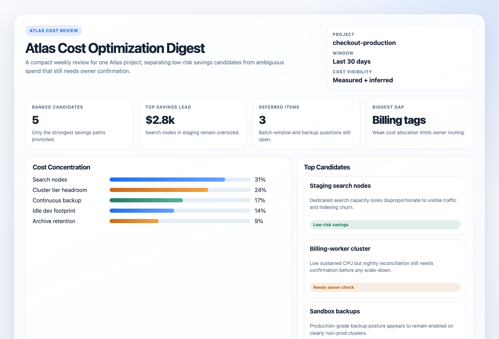
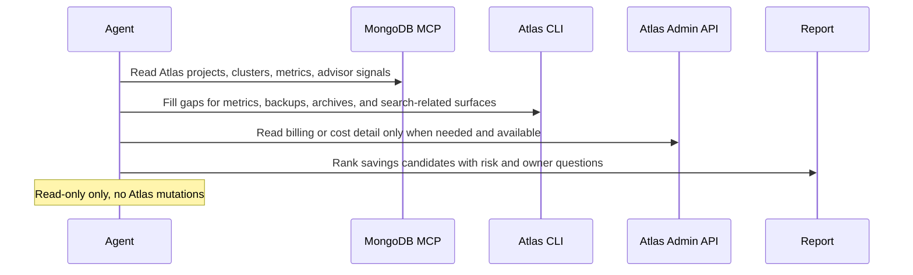

# Atlas Cost Optimization Digest

## Overview

This automation reviews one MongoDB Atlas project and highlights where you may be overpaying for clusters, storage, backups, archives, or search. It is read-only and meant to help a human decide what to optimize next.
## Preview



## How It Works

1. Requires one explicit Atlas project and defaults everything else to a rolling 30-day review with inference-first behavior.
2. Reads Atlas inventory, sizing, auto-scaling, usage signals, backup posture, archive usage, and Search-related capacity.
3. Uses billing or Cost Explorer data when available; otherwise it labels findings as inferred from usage and configuration.
4. Ranks the strongest candidates and returns evidence, risk, owner questions, and the next best check.



## When To Use It

- you want a recurring Atlas cost review for one project
- you need cluster, storage, backup, archive, and search costs interpreted together
- you want read-only findings before anyone makes scaling or retention changes

## Prerequisites

- Read access to the target Atlas project through MongoDB MCP, Atlas CLI, Atlas Admin API, or a combination of them
- `Project Read Only` or stronger for inventory, metrics, and advisor signals
- `Organization Billing Viewer` or stronger if you want invoice-backed or Cost Explorer-backed spend details
- An explicit Atlas project set in the prompt

## Cursor Cloud Usage

1. Open [Cursor Automations](https://cursor.com/automations/new).
2. Name your automation and paste [atlas-cost-optimization-digest.md](/Users/adamchmara/projects/ai-agent-automations/automations/atlas-cost-optimization-digest/atlas-cost-optimization-digest.md) as the prompt.
3. Add MongoDB MCP with Atlas API credentials in read-only mode.
4. If MCP does not expose the backup, archive, billing, or search detail you need, also make the Atlas CLI available.
5. Set the Atlas project in the prompt, save the automation, and start with a weekly schedule.

## Codex App Usage

1. Click `Automation` > `New Automation`.
2. Name your automation and paste [atlas-cost-optimization-digest.md](/Users/adamchmara/projects/ai-agent-automations/automations/atlas-cost-optimization-digest/atlas-cost-optimization-digest.md) as the prompt.
3. Install the official MongoDB plugin for Codex or configure the MongoDB MCP Server manually.
4. If you need backup, archive, process-metric, or billing detail beyond MCP coverage, make the Atlas CLI available too.
5. Set the Atlas project in the prompt and save the automation.

## Claude Code / Codex CLI / Copilot Usage

1. Configure MongoDB MCP with Atlas API credentials, or make the Atlas CLI available with authenticated read access.
2. If you need invoice or Cost Explorer context, make sure the runtime also has organization billing visibility.
3. Keep the automation read-only and run it against one explicit Atlas project at a time.
4. For repeated checks in an open Claude Code session, use `/loop`, for example:

```text
/loop 1w Follow the instructions in automations/atlas-cost-optimization-digest/atlas-cost-optimization-digest.md
```

5. For durable Claude-managed automation, use `/schedule` or create a Routine in `claude.ai/code/routines`.

## CLI Setup

```bash
brew install mongodb-atlas-cli
atlas auth login
atlas auth whoami
```

Use `atlas api` only when MCP or the higher-level CLI surface does not expose the read-only detail you need.

## Recommended Defaults

| Setting | Default |
| --- | --- |
| Atlas scope | `one explicit Atlas project` |
| Review window | `last 30 days` |
| Mutation policy | `report only` |
| Final ranked candidates | `up to 8` |
| Cost visibility | `prefer measured billing, otherwise inferred` |
| Savings language | `measured dollars when visible, otherwise qualitative direction` |
| Delivery | `Markdown digest with optional static HTML artifact` |

Keep the interpretation conservative: low CPU alone is not enough for a scale-down recommendation, billing gaps should reduce confidence, and production backup changes should always require owner confirmation.

## Prompt Inputs

Use the project name at minimum:

```text
Atlas project: checkout-production
```

Add extra context only when Atlas cannot infer it safely, for example:

```text
Atlas project: checkout-production
Known no-touch clusters or policies: billing-primary requires PITR and cross-region snapshot distribution
The nightly reconciliation job runs from 01:00 to 03:00 UTC and can spike CPU and disk briefly.
```

## Docs

- [MongoDB MCP Server](https://www.mongodb.com/docs/mcp-server/)
- [Atlas CLI](https://www.mongodb.com/docs/atlas/cli/current/)
- [Codex Automations](https://openai.com/academy/codex-automations)
