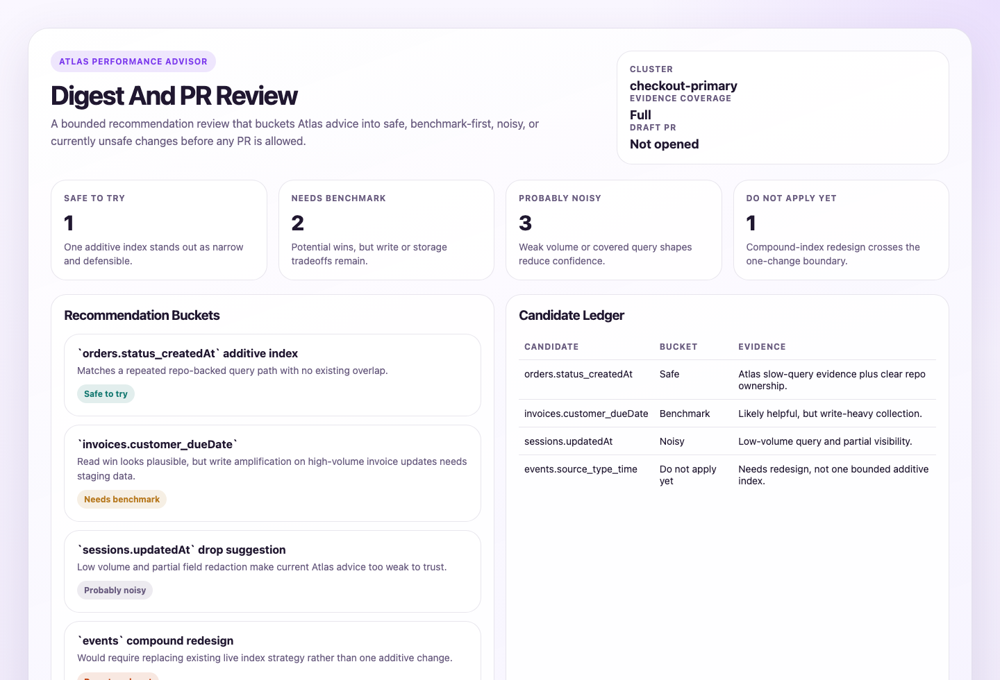
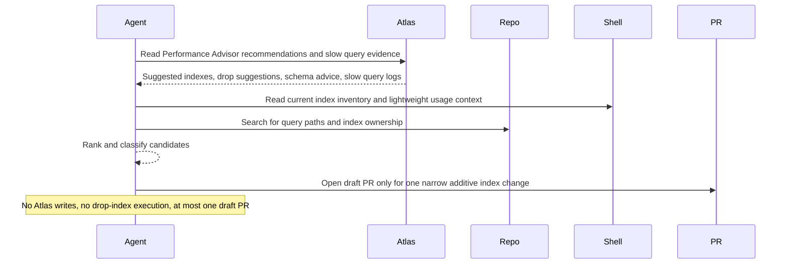

# Atlas Performance Advisor Digest And PR

## Overview

This automation checks Atlas Performance Advisor suggestions, filters out noisy ones, and shows which changes look worth testing. If one index change is clearly safe, it can draft a small PR.
## Preview



## How It Works

1. Requires explicit Atlas project, cluster, review window, and allowed write paths if PR creation is enabled.
2. Reads Atlas Performance Advisor signals such as suggested indexes, slow queries, drop-index suggestions, and schema advice.
3. Uses `mongosh`, the current repository, and optional GitHub search to check current indexes, usage context, and code ownership.
4. Ranks candidates as `safe to try`, `needs benchmark`, `probably noisy`, or `do not apply yet`.
5. Opens a draft PR only if one additive index change is clearly supported and the repo path is obvious.



## When To Use It

- you want Atlas recommendations reviewed instead of applied blindly
- you want one digest that combines Atlas, database, and repository evidence
- you want a draft PR only for a clearly supported single index addition

## Prerequisites

- Atlas CLI installed and authenticated
- Atlas access with at least `Project Read Only`
- `Project Data Access Read Only` or higher if you want non-redacted sample query fields
- An M10+ Atlas cluster, since Performance Advisor requires it
- Repository or GitHub search access if you want code-side corroboration
- Repository write access and PR tooling if you want the optional draft PR path
- Optional: MongoDB MCP or `mongosh` for extra database-side checks

## Cursor Cloud Usage

1. Open [Cursor Automations](https://cursor.com/automations/new).
2. Name your automation and paste [atlas-performance-advisor-digest-and-pr.md](/Users/adamchmara/projects/ai-agent-automations/automations/atlas-performance-advisor-digest-and-pr/atlas-performance-advisor-digest-and-pr.md) as the automation prompt.
3. Make the Atlas CLI available and authenticate it.
4. Add repository or GitHub search access if you want code correlation.
5. Add draft PR capability only if you want the write path.
6. Complete the run configuration, save the automation, and start with a weekly schedule.

## Codex App Usage

1. Make the Atlas CLI available and authenticate it.
2. Optional: add MongoDB MCP or `mongosh` for database-side corroboration.
3. Click `Automation` > `New Automation`.
4. Paste [atlas-performance-advisor-digest-and-pr.md](/Users/adamchmara/projects/ai-agent-automations/automations/atlas-performance-advisor-digest-and-pr/atlas-performance-advisor-digest-and-pr.md) as the prompt.
5. Add GitHub or equivalent PR tooling only if you want the draft PR path.
6. Complete the run configuration, set the schedule, and save.

## Claude Code / Codex CLI / Copilot Usage

1. Make the Atlas CLI available and authenticate it.
2. Optional: add MongoDB MCP or `mongosh` for database-side corroboration.
3. Make sure the runtime can read the repository or relevant GitHub code.
4. Add branch, commit, and draft PR capability only if you want the write path.
5. Complete the run configuration before scheduling repeated runs.
6. For repeated checks in an open Claude Code session, use `/loop`, for example:

```text
/loop 1w Follow the instructions in automations/atlas-performance-advisor-digest-and-pr/atlas-performance-advisor-digest-and-pr.md
```

7. For durable Claude-managed automation, use `/schedule` or create a Routine in `claude.ai/code/routines`.

## CLI Setup

```bash
brew install mongodb-atlas-cli
atlas auth login
```

Optional database-side corroboration:

```bash
brew install mongosh
```

The Atlas CLI is the required Atlas evidence path for this automation. Use `mongosh` only as extra corroboration.

## Recommended Defaults

| Setting | Default |
| --- | --- |
| Atlas project scope | `required in run configuration` |
| Atlas cluster scope | `required in run configuration` |
| Current review window | `required in run configuration` |
| Repository scope | `current repository when available` |
| Allowed write paths | `required for PR-capable runs` |
| First-pass candidate cap | `top 25 recommendations or slow-query shapes` |
| Final spotlight count | `top 8 candidates across all buckets` |
| Delivery | `Markdown digest, optional static HTML artifact, plus optional draft PR` |
| Mutation mode | `digest-first, one additive index PR max` |
| PR mode | `draft only` |
| Branch | `chore/atlas-index-addition-YYYY-MM-DD` |
| Commit message | `feat(db): add Atlas-suggested index` |

Keep the bar high for a PR: partial evidence should stay in the digest, drop-index suggestions are higher risk than additive indexes, and one strong recommendation is better than speculative index churn.

## Prompt Inputs

Use the required run scope at minimum:

```text
Allowed Atlas project(s): checkout-prod
Allowed Atlas cluster(s): checkout-primary
Current review window: last 7 days
Allowed write paths: db/migrations/**, packages/data/**
```

Add extra context only when the repo structure, priorities, or write-cost tradeoffs are not obvious from Atlas and code inspection.

## Docs

- [Atlas Performance Advisor](https://www.mongodb.com/docs/atlas/performance-advisor/)
- [Atlas CLI](https://www.mongodb.com/docs/atlas/cli/current/)
- [Codex Automations](https://openai.com/academy/codex-automations)
