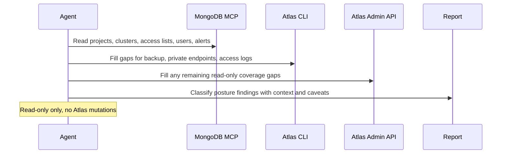

# Atlas Security Posture Digest

## Overview

This automation reviews access, network, backups, and alerts for one MongoDB Atlas project. It gives a short report of the security issues that matter most.
## Preview


## How It Works

1. Requires only the Atlas project scope. Everything else uses built-in defaults unless the operator later adds extra context in plain language.
2. Reads Atlas posture data from MongoDB MCP first, then Atlas CLI, then Atlas Admin API only for missing read-only surfaces.
3. Checks access lists, `0.0.0.0/0` exposure, users and roles, recent access history, backup coverage, alerts, and public-versus-private connectivity.
4. Separates findings into `Needs Attention`, `Acceptable With Context`, and `Needs Owner Confirmation`.
5. Produces one concise report with ranked findings and explicit coverage gaps.



## When To Use It

- you want a recurring Atlas security review without changing provider state
- you want access-control, backup, and alert posture interpreted together
- you need a project-level digest instead of checking Atlas screens manually

## Prerequisites

- Read access to the target Atlas organization and project through MongoDB MCP, Atlas CLI, Atlas Admin API, or a combination of them
- An explicit Atlas project set in the prompt
- Access to clusters, IP access lists, database users, alerts, and backup posture
- Access-history visibility if you want stale-user analysis beyond basic inventory
- Atlas CLI available if MCP does not expose every required read-only surface

## Cursor Cloud Usage

1. Open [Cursor Automations](https://cursor.com/automations/new).
2. Name your automation and paste [atlas-security-posture-digest.md](/Users/adamchmara/projects/ai-agent-automations/automations/atlas-security-posture-digest/atlas-security-posture-digest.md) as the automation prompt.
3. Add MongoDB MCP with Atlas API credentials in read-only mode.
4. If MCP does not expose every required surface, also make the Atlas CLI available.
5. Set the Atlas project in the prompt, save the automation, and run it on a schedule.

## Codex App Usage

1. Click `Automation` > `New Automation`.
2. Name your automation and paste [atlas-security-posture-digest.md](/Users/adamchmara/projects/ai-agent-automations/automations/atlas-security-posture-digest/atlas-security-posture-digest.md) as the automation prompt.
3. Install or configure MongoDB MCP with Atlas API credentials in read-only mode.
4. If you need backup, private-endpoint, or access-history coverage beyond MCP, make the Atlas CLI available too.
5. Set the Atlas project name in the prompt and save the automation.

## Claude Code / Codex CLI / Copilot Usage

1. Configure MongoDB MCP with Atlas API credentials, or make the Atlas CLI available with authenticated read access.
2. Make sure the runtime can read the Atlas organization, project, cluster, user, access-list, backup, and alert surfaces you need.
3. For repeated checks in an open Claude Code session, use `/loop`, for example:

```text
/loop 1w Follow the instructions in automations/atlas-security-posture-digest/atlas-security-posture-digest.md
```

4. For durable Claude-managed automation, use `/schedule` or create a Routine in `claude.ai/code/routines`.

## CLI Setup

```bash
brew install mongodb-atlas-cli
atlas auth login
```

Use `atlas api` only when MCP or the higher-level CLI surface does not expose the read-only detail you need.

## Recommended Defaults

| Setting | Default |
| --- | --- |
| Atlas scope | `one explicit Atlas project` |
| Mutation policy | `report only` |
| Project resolution | `match one explicit Atlas project; infer organization from that project when possible` |
| Access-list review | `all project entries, with special attention to 0.0.0.0/0 and very broad CIDRs` |
| Private networking expectation | `prefer private networking for production-like projects; otherwise treat public access as context-sensitive` |
| Backup expectation | `dedicated production-like clusters should have backups enabled; stronger compliance expectations are optional` |
| Critical alert baseline | `warn when core availability and host-health coverage appears missing, but do not block if no custom baseline is supplied` |
| Stale-user threshold | `90 days without observed recent access unless stricter policy is supplied` |
| Access-history window | `last 7 days when available, otherwise inventory-only with a coverage gap` |
| Final ranked findings | `up to 10` |
| Output | `Markdown security posture report with optional static HTML artifact` |

Keep the interpretation conservative: broad exposure and missing backups or alerts should rank high, but temporary exceptions, intended public paths, and missing access-history coverage should be labeled clearly instead of overclaimed.

## Prompt Inputs

Use the project name at minimum:

```text
Atlas project: checkout-production
```

Add extra context only when the project has stricter rules or known exceptions, for example:

```text
Atlas project: checkout-production
Treat any public IP allowlist entry as suspicious unless it is the approved office NAT or break-glass entry.
Only the break-glass DBA account and platform automation account should have atlasAdmin.
This production project is expected to use private networking and managed backups.
```

## Docs

- [MongoDB MCP Server](https://www.mongodb.com/docs/mcp-server/)
- [Atlas CLI](https://www.mongodb.com/docs/atlas/cli/current/)
- [Codex Automations](https://openai.com/academy/codex-automations)
