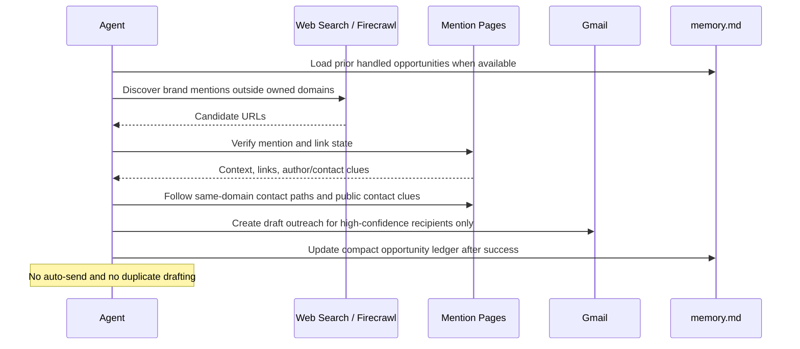

# Backlink Opportunity Finder

## Overview

This automation finds public pages that mention your brand without linking to your site, looks for the best available contact path, and prepares Gmail outreach drafts. It helps founders turn existing brand mentions into realistic SEO and referral opportunities without auto-sending cold email.

## How It Works

1. Starts from a bounded set of brand, product, and founder-name searches outside your own domain.
2. Verifies each candidate page and keeps only real public mentions that do not already link correctly.
3. Uses `memory.md` when available to avoid reprocessing pages, redrafting the same opportunity, or retrying recently blocked contacts too soon.
4. Scores the remaining opportunities by editorial quality, relevance, freshness, and contactability.
5. Tries best-effort contact discovery through author pages, contact pages, mastheads, same-domain crawl paths, and public-web follow-up.
6. Creates Gmail drafts only when the recipient confidence is strong enough. Otherwise it reports the opportunity as found but unresolved.
7. Produces one run report showing what was drafted, skipped, blocked, or already handled.



## When To Use It

- people already mention your brand, product, or founder in public pages but often forget to link
- you want backlink opportunities with a low-friction ask instead of generic outreach
- you want Gmail drafts a founder can review quickly instead of raw SEO prospect lists
- you want recurring follow-up without repeatedly touching the same low-quality domains

## Prerequisites

- Public web discovery and fetch capability
- Gmail access with draft creation if you want the automation to write back into Gmail
- Optional persistent automation memory if you want duplicate suppression and retry deferrals across runs

Preferred stack:

- Firecrawl for search, scrape, and same-domain crawl assistance
- Gmail MCP or a Google Workspace MCP surface for draft creation

Fallbacks are acceptable when they preserve the same behavior: bounded public-web discovery, page verification, best-effort contact discovery, and Gmail draft-only writes.

## Cursor Cloud Usage

1. Open [Cursor Automations](https://cursor.com/automations/new).
2. Name your automation and paste [backlink-opportunity-finder.md](/Users/adamchmara/projects/ai-agent-automations/automations/backlink-opportunity-finder/backlink-opportunity-finder.md) as the automation prompt.
3. Add Firecrawl or an equivalent web-discovery surface that can search and read public pages.
4. Add Gmail access with draft creation.
5. Allow durable memory if your runner supports it so the automation can reuse `memory.md`.
6. Start with manual or weekly runs before increasing cadence.

## Codex App Usage

1. Add a public-web discovery surface such as Firecrawl when available.
2. Enable Gmail access in Codex and verify draft creation works.
3. Click `Automation` > `New Automation`.
4. Paste [backlink-opportunity-finder.md](/Users/adamchmara/projects/ai-agent-automations/automations/backlink-opportunity-finder/backlink-opportunity-finder.md) as the automation prompt.
5. Keep the automation draft-only and review the first few runs closely.
6. Let the automation reuse `memory.md` between runs if durable memory is available.

## Claude Code / Codex CLI / Copilot Usage

1. Make one public-web search and fetch path available. Firecrawl is preferred when available because it can help with both discovery and same-domain contact crawling.
2. Make Gmail draft creation available through MCP or another trusted Gmail integration.
3. Use the prompt as-is before using `/loop` or `/schedule`.
4. Keep the workflow draft-only. If someone wants auto-send, follow-up scheduling, or CRM mutation, split that into separate approved automations.
5. For repeated checks in an open Claude Code session, use `/loop`, for example:

```text
/loop mondays at 9am Follow the instructions in automations/backlink-opportunity-finder/backlink-opportunity-finder.md
```

## Recommended Defaults

| Setting | Default |
| --- | --- |
| Cadence | `weekly` |
| Query scope | `brand, product, and optional founder aliases outside owned domains` |
| Candidate cap | `up to 50 candidate pages screened` |
| Verified opportunities | `up to 15 unlinked mentions ranked` |
| Draft cap | `up to 5 Gmail drafts per run` |
| Contact policy | `best-effort discovery, draft only on high or strong-medium confidence` |
| Memory policy | `use memory when available; otherwise run stateless` |
| Output mode | `report plus Gmail drafts when writable` |

Keep the run conservative: verify live pages before drafting, prefer one strong recipient over many weak guesses, skip scraper farms and junk directories, and do not retry low-confidence opportunities too aggressively.

## Prompt Inputs

Add context only when the automation cannot infer it safely, for example:

```text
Primary brand terms: Novu, novu, Novu API
Owned domains to exclude: novu.co, docs.novu.co, novu.readme.io
Preferred target URLs:
- pricing mentions -> https://novu.co/pricing
- notification infrastructure mentions -> https://novu.co
- changelog or docs mentions -> https://docs.novu.co
Domains to suppress: linkedin.com, crunchbase.com, g2.com
```

## Docs

- [Firecrawl Docs](https://docs.firecrawl.dev)
- [Codex Automations](https://openai.com/academy/codex-automations)
