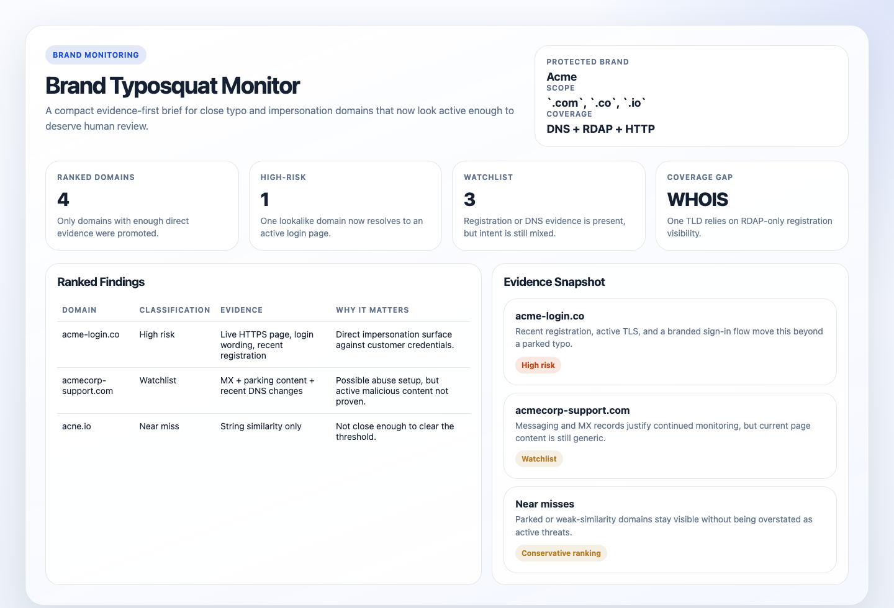
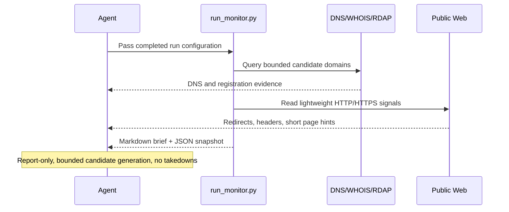

# Brand Typosquat Monitor

## Overview

This automation checks likely typo and impersonation domains around a brand or main domain. It gives a short risk report so someone can decide what to investigate.
## Preview



Use it when you want a recurring answer to "did any close typo or impersonation domains around our brand start looking active or risky?" rather than a claim of exhaustive global coverage.

## How It Works

1. Reads a required run-configuration block with the protected brand and canonical domains.
2. Runs the bundled Python collector with those inputs.
3. Derives a compact set of close typo and impersonation candidates from that brand family.
4. Checks public DNS, registration, and lightweight HTTP or HTTPS evidence for each candidate with bounded parallelism and timeouts.
5. Ranks only the candidates that look worth human review and returns a concise brief.



## When To Use It

- you want a daily or weekly first-pass monitor for one brand or domain family
- you want a compact triage brief rather than a giant list of permutations
- you want ambiguous evidence ranked instead of relying on raw similarity alone

Do not use it for exhaustive internet-wide discovery, broad homoglyph coverage, or automated takedown workflows.

## Prerequisites

- `python3`
- `dig` for DNS evidence
- Public HTTPS access for RDAP and lightweight web checks
- Optional `whois` as secondary registration evidence
- A completed run-configuration block in the prompt

If `dig` is unavailable, the collector should stop instead of guessing.

## Cursor Cloud Usage

1. Open [Cursor Automations](https://cursor.com/automations/new).
2. Name your automation and paste [brand-typosquat-monitor.md](/Users/adamchmara/projects/ai-agent-automations/automations/brand-typosquat-monitor/brand-typosquat-monitor.md) as the automation prompt.
3. Make sure the runtime can execute `python3` and `dig`, and can reach public HTTPS endpoints. `whois` is optional.
4. Replace the required run-configuration block inside the prompt with the protected brand and canonical domains before saving the automation.
5. Set the schedule or run manually, then save the automation.

## Codex App Usage

1. Click `Automation` > `New Automation`.
2. Name your automation and paste [brand-typosquat-monitor.md](/Users/adamchmara/projects/ai-agent-automations/automations/brand-typosquat-monitor/brand-typosquat-monitor.md) as the automation prompt.
3. Make sure the runtime can execute `python3` and `dig`, and can reach public HTTPS endpoints. `whois` is optional.
4. Replace the required run-configuration block inside the prompt before saving the automation.
5. Set the schedule or run manually and save the automation.

## Claude Code / Codex CLI / Copilot Usage

1. Make sure the runtime can execute `python3` and `dig`, and can reach public DNS and HTTPS endpoints.
2. Replace the run-configuration block in the prompt before using `/loop` or `/schedule`. For example:

```text
Protected brand or company name: Acme
Canonical domains or official URLs: acme.com, app.acme.com
Optional high-risk terms: login, secure, support, billing, account
```

3. The preferred direct invocation is:

```text
python3 automations/brand-typosquat-monitor/run_monitor.py \
  --workspace . \
  --brand "Novu" \
  --canonical "novu.co, app.novu.co, docs.novu.co" \
  --high-risk-terms "login, dashboard, auth, support, billing"
```

4. For repeated checks in an open Claude Code session, use `/loop`, for example:

```text
/loop 1d Follow the instructions in automations/brand-typosquat-monitor/brand-typosquat-monitor.md
```

5. For durable Claude-managed automation outside the current session, use `/schedule` or create a Routine in `claude.ai/code/routines`.

## Recommended Defaults

| Setting | Default |
| --- | --- |
| Brand scope | `one protected brand or domain family per run` |
| Input mode | `required run-configuration block with protected brand and canonical domains` |
| Collector | `python3 automations/brand-typosquat-monitor/run_monitor.py` |
| Candidate count | `up to 75 generated domains total` |
| TLD scope | `canonical TLDs plus com, net, org, io` |
| Evidence sources | `DNS first, RDAP second, WHOIS secondary when needed, lightweight HTTP or HTTPS after that` |
| Final findings | `up to 10 ranked domains` |
| Output | `Markdown risk brief with optional static HTML artifact` |
| Writes | `none` |

Keep the run conservative: prefer the script's bounded candidate set over speculative generation, treat MX/HTTPS/login-like wording and suspicious redirects as stronger signals than similarity alone, and use `watchlist` when the evidence is mixed.

## Prompt Inputs

Replace the run-configuration block with something like:

```text
Protected brand or company name: Acme
Canonical domains or official URLs: acme.com
Optional high-risk terms: login, secure, support, billing, account
```

Keep `Optional high-risk terms` short so the candidate set stays bounded. Add instructions only when needed, for example to write for a security reviewer or to downgrade borderline domains to `watchlist` when evidence is incomplete.

## Files

- Entrypoint: [run_monitor.py](/Users/adamchmara/projects/ai-agent-automations/automations/brand-typosquat-monitor/run_monitor.py)
- Collector package: [brand_monitor](/Users/adamchmara/projects/ai-agent-automations/automations/brand-typosquat-monitor/brand_monitor)
- Prompt wrapper: [brand-typosquat-monitor.md](/Users/adamchmara/projects/ai-agent-automations/automations/brand-typosquat-monitor/brand-typosquat-monitor.md)

## Docs

- [Codex Automations](https://openai.com/academy/codex-automations)
