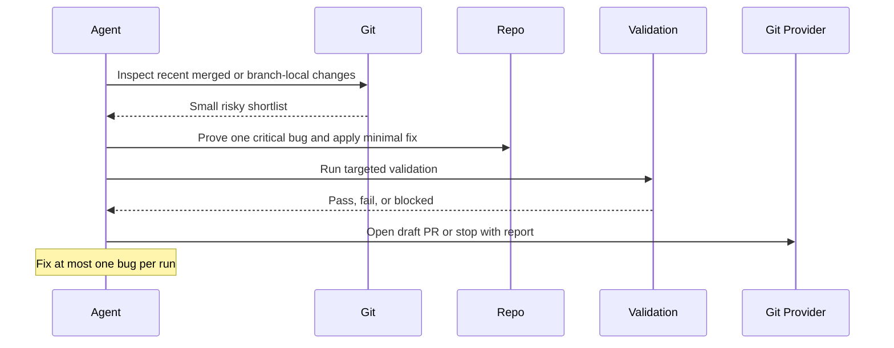

# Critical Bug Fix PR

## Overview

This automation reviews recent high-risk code changes, proves one real critical bug when it can, and applies the smallest safe fix. If the fix is trustworthy, it opens a draft PR.
## How It Works

1. Uses the current repository and discovers the narrowest trustworthy recent production-code scope.
2. Prefers recent merged changes on the default branch, unless default-branch history cannot be resolved safely.
3. Builds a small shortlist of risky recent changes, then deep-reviews at most three candidates.
4. Skips candidates that already appear to have an obvious fix in flight.
5. Selects at most one candidate only when the trigger scenario, impact, and root cause are all concrete.
6. Implements the smallest safe fix, adds targeted regression coverage when feasible, and runs the narrowest relevant validation.
7. Opens a draft PR or stops with a clear report when no safe fix should be made.



## When To Use It

- you want one small draft PR that addresses a severe bug introduced by a recent meaningful code change
- the repository has a clear default branch and readable git history
- the repository has narrow validation commands for the affected area

## Prerequisites

- Git access to inspect recent history and create a branch
- repository write access if you want the automation to apply a fix
- GitHub or equivalent PR tooling if you want automatic draft PR creation
- runnable validation commands for the affected surface

Monorepos are supported when one risky change maps cleanly to one workspace or service. If a candidate fix would require broad multi-workspace coordination, cross-repository edits, migrations, or production data repair, the automation should stop instead of guessing.

## Cursor Cloud Usage

1. Open [Cursor Automations](https://cursor.com/automations/new).
2. Name your automation and paste [critical-bug-fix-pr.md](/Users/adamchmara/projects/ai-agent-automations/automations/critical-bug-fix-pr/critical-bug-fix-pr.md) as the automation prompt.
3. Add the `Open Pull Request` tool, or let the agent use existing PR tooling in the runtime.
4. Make sure the environment can inspect git history and run the repository's narrowest relevant validation commands.
5. Click `Create`.

## Codex App Usage

1. Click `Automation` > `New Automation`.
2. Name your automation and paste [critical-bug-fix-pr.md](/Users/adamchmara/projects/ai-agent-automations/automations/critical-bug-fix-pr/critical-bug-fix-pr.md) as the automation prompt.
3. Set the schedule or run manually and save the automation.
4. Add the GitHub plugin to Codex, or let Codex use existing GitHub CLI or PR tooling in the environment.
5. Make sure the runtime can run the repository's targeted validation commands for the affected area.

## Claude Code Usage

1. No extra MCP setup is required for the core prompt.
2. Make sure the runtime has git, validation commands, and PR tooling if you want automatic draft PR creation.
3. For repeated checks in an open Claude Code session, use `/loop`, for example:

```text
/loop weekdays at 10am Follow the instructions in automations/critical-bug-fix-pr/critical-bug-fix-pr.md
```

4. For durable Claude-managed automation that survives outside the current session, use `/schedule` or create a Routine in `claude.ai/code/routines`.

## Recommended Defaults

| Setting | Default |
| --- | --- |
| Review scope on default branch | `merged PRs from the last 72h, capped at 15` |
| Fallback review scope | `last 30 commits on the default branch` |
| Deep-review candidates per run | `3` |
| Bugs fixed per run | `1` |
| PR mode | `draft-pr` |
| Branch | `fix/critical-bug-fix-pr-YYYY-MM-DD` |
| Commit message | `fix: patch critical regression` |

Keep the run conservative: prefer no PR over a speculative fix, prefer one narrow fix over broader cleanup, skip candidates that already have an obvious fix in flight, and keep every PR as a draft.

## Prompt Inputs

Add context only when the repo conventions are not obvious, for example:

```text
For validation, prefer:
pnpm --filter api test -- src/auth/session.test.ts
pnpm --filter worker test -- src/jobs/retry-queue.test.ts
pytest tests/billing/test_invoice_write_path.py

Do not touch billing, auth, migrations, infrastructure, or data-repair scripts.
Skip any candidate that requires more than one service or workspace to validate.
```

## Docs

- [Codex Automations](https://openai.com/academy/codex-automations)
