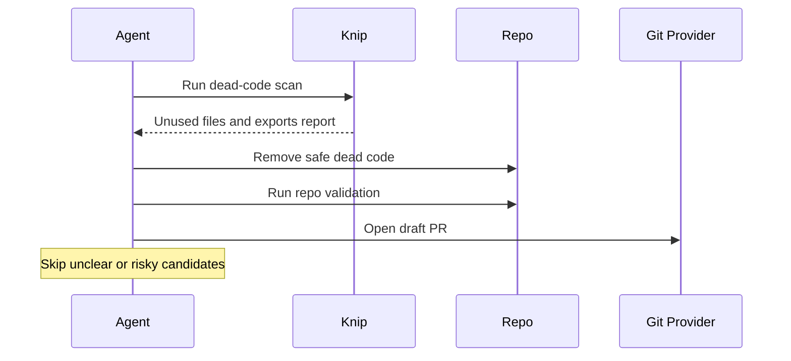

# Dead Code Sweep

## Overview

This automation looks for code that appears unused, removes only low-risk candidates, and checks that the cleanup still passes validation. It is for steady maintenance, not aggressive deletion.
## How It Works

1. Runs `knip` and reads both the report and diagnostics output.
2. Picks a number of obviously safe dead-code candidates.
3. Removes safe unused files or exports conservatively.
4. Runs validation for the affected surfaces and opens a draft PR or prepares PR-ready output.




## Prerequisites

- Node.js `20.19.0+` or Bun, per Knip v6 requirements
- `knip` is available in the repo or runner environment
- GitHub or equivalent PR tooling if you want automatic PR creation

## Knip Setup

Preferred setup is a repo-local `knip` script. One common setup is:

```bash
pnpm create @knip/config
```

Or install it manually:

```bash
pnpm add -D knip typescript @types/node
```

Then add a script such as:

```json
{
  "scripts": {
    "knip": "knip"
  }
}
```

Runner-only fallback:

```bash
pnpm dlx knip
```

For ephemeral runners this is often better than a global install.

## Cursor Cloud Usage

1. Open [Cursor Automations](https://cursor.com/automations/new).
2. Name your automation and paste [dead-code-sweep.md](/Users/adamchmara/projects/ai-agent-automations/automations/dead-code-sweep/dead-code-sweep.md) as the automation prompt.
3. Add trigger conditions.
4. Add the `Open Pull Request` tool, or let the agent use an existing GitHub CLI or plugin in the environment.
5. Make sure the runtime can execute `pnpm knip` or your chosen Knip fallback and the validation commands you expect.
6. Click `Create`.

## Codex App Usage

1. Click `Automation` > `New Automation`.
2. Name your automation and paste [dead-code-sweep.md](/Users/adamchmara/projects/ai-agent-automations/automations/dead-code-sweep/dead-code-sweep.md) as the automation prompt.
3. Set schedule or run manually and save the automation.
4. Add the GitHub plugin to Codex, or let Codex use an existing GitHub CLI/tool in the agent environment.
5. Make sure the environment can run `pnpm knip` or your chosen Knip fallback and the validation commands relevant to your repo.

## Claude Code Usage

1. No extra MCP setup is required for this automation.
2. Make sure the runtime can execute a Knip command and the validation commands you expect. Preferred: repo-local `knip` script. Fallback: `pnpm dlx knip` in ephemeral runners.
3. For repeated checks in an open Claude Code session, use `/loop`, for example:

```text
/loop 1d Follow the instructions in automations/dead-code-sweep/dead-code-sweep.md
```

4. For durable Claude-managed automation that survives outside the current session, use `/schedule` or create a Routine in `claude.ai/code/routines`.

## Recommended Defaults

This automation assumes:

- repo-local scan command: `pnpm knip --reporter markdown > .artifacts/dead-code.md 2> .artifacts/dead-code.stderr`
- runner fallback scan command: `pnpm dlx knip --reporter markdown > .artifacts/dead-code.md 2> .artifacts/dead-code.stderr`
- report path: `.artifacts/dead-code.md`
- diagnostics path: `.artifacts/dead-code.stderr`


| Setting                   | Default                                     |
| ------------------------- | ------------------------------------------- |
| Max candidates per run    | `3`                                         |
| Max files changed per run | `10`                                        |
| Branch                    | `chore/dead-code-sweep-YYYY-MM-DD`          |
| Commit message            | `chore(code-health): remove safe dead code` |
| PR mode                   | `Draft`                                     |


Keep the run conservative: skip unclear candidates, skip framework-managed files unless registration is obvious, and keep the PR draft when validation is partial.

## Prompt Inputs

Add context only when repo guardrails or validation are not obvious, for example:

```text
Skip anything under enterprise/.
Do not remove *.module.ts, main.ts, package.json, tsconfig*, or *.config.*.
For validation, run:
pnpm --filter api exec tsc --noEmit
pnpm --filter web exec tsc --noEmit
```

## Docs

- [Knip Getting Started](https://knip.dev/overview/getting-started)
- [Knip Configuration](https://knip.dev/overview/configuration)
- [Codex Automations](https://openai.com/academy/codex-automations)
