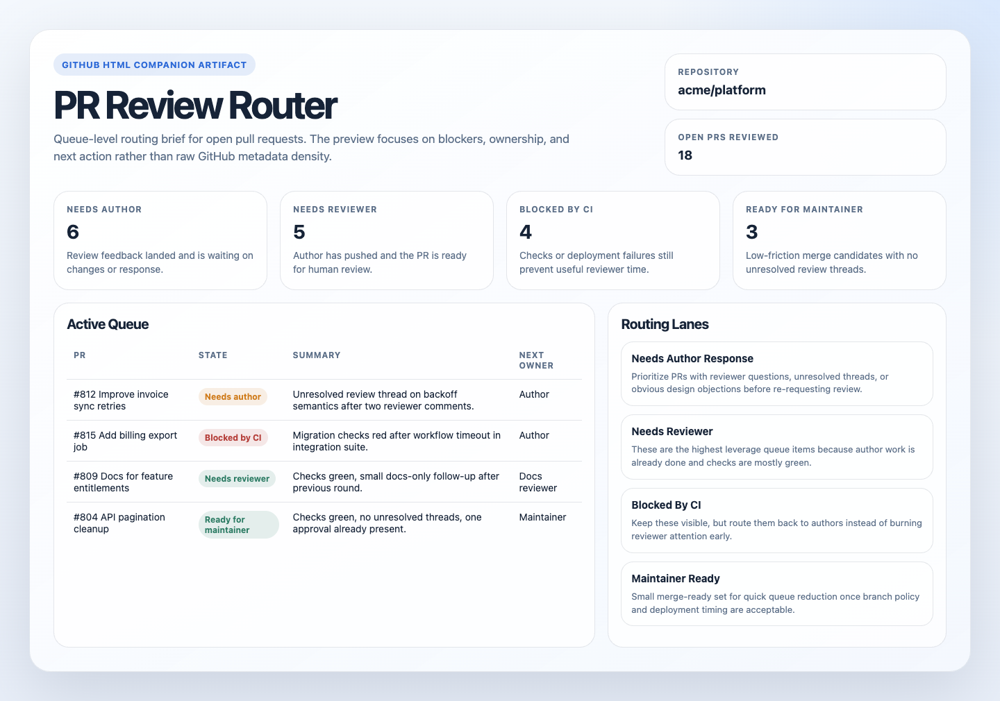
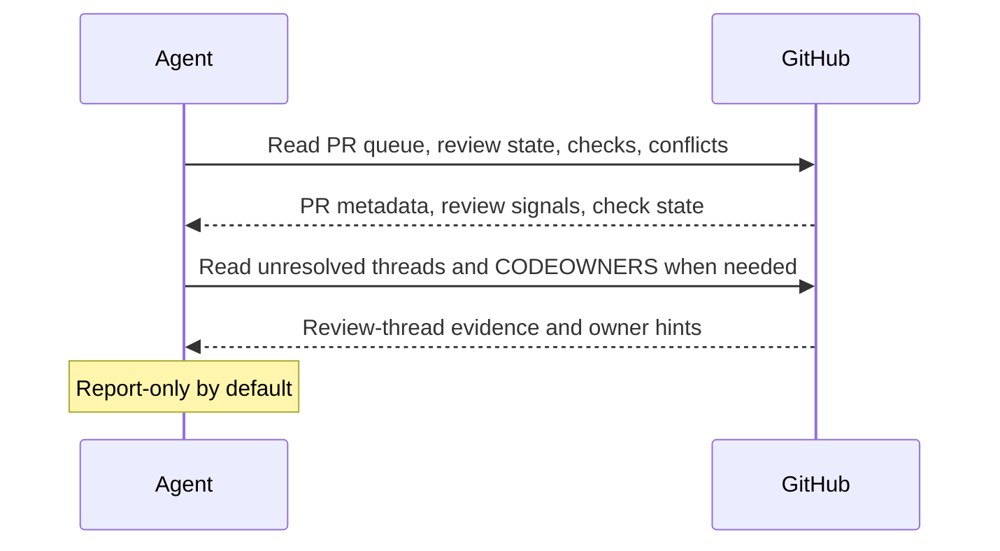

# GitHub PR Review Router

## Overview

This automation reviews the open PR queue and sorts each PR by its real blocking state, such as waiting on author, reviewer, or CI. It helps teams know where attention should go next.
## Preview



## How It Works

1. Reads a bounded set of open pull requests from the current repository or the explicitly provided repository scope.
2. Expands each PR with review state, unresolved threads when available, checks, conflicts, labels, reviewers, and recent activity.
3. Adds a short plain-language summary so the queue is understandable without opening every PR.
4. Classifies each PR into states such as `needs author response`, `needs reviewer`, `blocked by CI`, or `ready for maintainer`.
5. Produces a compact routing report with the next best owner or action for each PR.




## When To Use It

- maintainers need a daily or weekly PR queue sweep
- teams want a review-routing digest before a review block
- you want open PRs separated by real blocking state instead of treated as one undifferentiated queue

## Prerequisites

- GitHub read access for pull requests, issues, reviews, and checks
- GitHub MCP, a GitHub connector, or `gh` CLI access

## Cursor Cloud Usage

1. Open [Cursor Automations](https://cursor.com/automations/new).
2. Name your automation and paste [github-pr-review-router.md](/Users/adamchmara/projects/ai-agent-automations/automations/github-pr-review-router/github-pr-review-router.md) as the automation prompt.
3. Add GitHub access with read permission for pull requests, reviews, issues, and checks.
4. Set a schedule or run manually, then create the automation.

## Codex App Usage

1. Add the GitHub plugin to Codex, `gh` CLI, or a GitHub MCP server with read access for pull requests, reviews, checks, and repository search.
2. Click `Automation` > `New Automation`.
3. Name your automation and paste [github-pr-review-router.md](/Users/adamchmara/projects/ai-agent-automations/automations/github-pr-review-router/github-pr-review-router.md) as the automation prompt.
4. Set the schedule or run manually and save the automation.

## Claude Code Usage

1. Add a GitHub MCP server in Claude Code and authenticate it, or make `gh` available in the runtime as the main GitHub interface.
2. For repeated checks in an open Claude Code session, use `/loop`, for example:

```text
/loop weekdays at 9am Follow the instructions in automations/github-pr-review-router/github-pr-review-router.md
```

3. For durable Claude-managed automation, use `/schedule` or create a Routine in `claude.ai/code/routines`.

## Recommended Defaults


| Setting           | Default                      |
| ----------------- | ---------------------------- |
| Repository scope  | `current repository`         |
| PR scope          | `open pull requests`         |
| First-pass PR cap | `30`                         |
| Stale threshold   | `3 days`                     |
| Delivery          | `markdown report or preview` |
| Writes            | `none`                       |


Keep the automation report-only. If unresolved threads cannot be read, say that clearly instead of inferring readiness, and prefer short summaries plus the next best action over dense status dumps.

## Prompt Inputs

Add policy only when GitHub state alone is not enough, for example:

```text
Treat "changes requested" as needs author response until every requested change thread is resolved or explicitly superseded.
Do not route bot-authored dependency PRs into the main reviewer queue unless they are failing or older than 3 days.
Prioritize PRs that block a release branch or have been waiting on reviewer action for more than 2 business days.
```

## Docs

- [Codex Automations](https://openai.com/academy/codex-automations)
- [GitHub CLI](https://cli.github.com/manual/)
