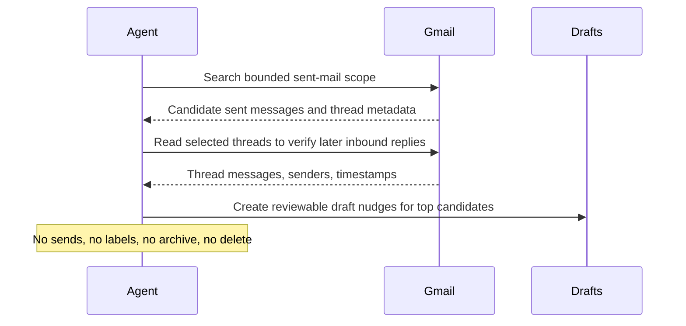

# Gmail Sent Email Follow-Up Watcher

## Overview

This automation looks for sent threads that have likely gone quiet and drafts follow-up nudges. It helps important conversations avoid falling through the cracks.
## How It Works

1. Starts from an explicit Gmail scope and a bounded time window from the prompt's required run-configuration block.
2. Reads only the selected sent-mail slice and excludes obvious bulk, automated, or no-reply traffic.
3. Expands only the most relevant threads and checks whether a later inbound reply from someone else appears in the thread after the outbound message.
4. Ranks the unreplied candidates by age, importance hints, and whether the original message contained a concrete ask, deadline, or requested decision.
5. Produces one concise follow-up queue and, when allowed, creates Gmail draft replies for the clearest top candidates.



## Prerequisites

- Gmail access through either:
  - the OpenAI-curated `gmail@openai-curated` plugin in Codex; or
  - a Google Workspace MCP server; or
  - the `gws` CLI when your runner uses that as its Gmail path.
- A completed required run-configuration block in the prompt with one real Gmail scope and one real cooldown or sensitivity policy.
- Permission to create Gmail drafts if you want the automation to write drafts into Gmail. If draft creation is unavailable, the automation still returns markdown-ready draft text.

This automation works best when the Gmail scope is explicit and stable, for example sent mail from one account plus a bounded query that excludes bulk or automated traffic.

## Cursor Cloud Usage

1. Open [Cursor Automations](https://cursor.com/automations/new).
2. Name your automation and paste [gmail-sent-email-follow-up-watcher.md](/Users/adamchmara/projects/ai-agent-automations/automations/gmail-sent-email-follow-up-watcher/gmail-sent-email-follow-up-watcher.md) as the automation prompt.
3. Add Gmail access through a Google Workspace MCP server when available.
4. If your Cursor runner prefers CLI access, make sure `gws` is installed and authenticated for Gmail reads and Gmail draft creation.
5. Replace the placeholder values in the smaller required run-configuration block before saving the automation.
6. Start with manual runs or a weekday schedule until the queue quality is stable.

## Codex App Usage

1. Enable `gmail@openai-curated` from the `Plugins` UI in Codex, or configure a Google Workspace MCP server with Gmail access.
2. Authenticate Gmail access and verify the runtime can read sent messages, read threads, and create Gmail drafts.
3. Click `Automation` > `New Automation`.
4. Paste [gmail-sent-email-follow-up-watcher.md](/Users/adamchmara/projects/ai-agent-automations/automations/gmail-sent-email-follow-up-watcher/gmail-sent-email-follow-up-watcher.md) as the automation prompt.
5. Replace the placeholder values in the smaller required run-configuration block before saving the automation.
6. Keep the first runs draft-only and review the produced queue before increasing cadence.

## Claude Code / Codex CLI / Copilot Usage

1. In Codex CLI, enable `gmail@openai-curated` from `/plugins`, or make a Google Workspace MCP server available.
2. In Claude Code or Copilot coding-agent environments, prefer a Google Workspace MCP server when available, or `gws` otherwise.
3. Replace the required run-configuration values at the top of the prompt before using `/loop` or `/schedule`. The built-in defaults are `5 days` for follow-up delay and a simple importance heuristic that favors concrete asks, external recipients, and older threads. For example:

```text
Gmail sent-mail scope: in:sent newer_than:21d -label:automated-followups
Cooldown and sensitivity rules: no repeated draft if I already followed up in the last 5 days; skip legal, HR, dispute, and recruiting threads
```

4. Keep this automation draft-first. If someone wants automatic sends, label changes, or CRM writes, split that into a separate approved automation.
5. For repeated checks in an open Claude Code session, use `/loop`, for example:

```text
/loop weekdays at 9am Follow the instructions in automations/gmail-sent-email-follow-up-watcher/gmail-sent-email-follow-up-watcher.md
```

## Recommended Defaults

| Setting | Default |
| --- | --- |
| Gmail scope | `explicit sent-mail query only` |
| Search window | `last 21 days` |
| Follow-up delay | `5 days` |
| First-pass candidate pool | `up to 40 sent messages` |
| Final queue size | `up to 12 unreplied threads` |
| Draft cap | `up to 5 Gmail drafts` |
| Output | `Markdown follow-up queue with optional Gmail drafts` |
| Delivery mode | `draft-first and preview-first` |

Keep the run conservative: start from the explicit sent-mail scope, use Gmail thread evidence as the source of truth for reply detection, prefer fewer higher-confidence queue items, and stop if the Gmail scope is vague or still placeholder text.

## Prompt Inputs

Replace the run-configuration block with something like:

```text
Gmail sent-mail scope: in:sent newer_than:21d -category:promotions -label:newsletters
Cooldown and sensitivity rules: skip recruiting, legal, HR, and threads with any follow-up already sent in the last 5 days
```

Add policy only when needed, for example: queue only threads with a concrete ask, decision request, deadline, or scheduling prompt.

## Docs

- [Codex Automations](https://openai.com/academy/codex-automations)
