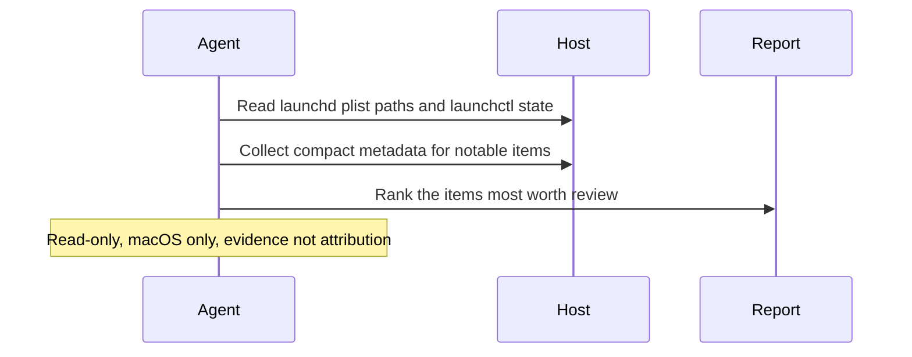

# LaunchAgent And LaunchDaemon Evidence Pack

## Overview

This automation reviews LaunchAgents and LaunchDaemons on a Mac and highlights the ones that look worth a human check. It is for gathering evidence, not making system changes.
## How It Works

1. Confirms the host is macOS and checks readable `launchd` surfaces.
2. Inventories standard LaunchAgents and LaunchDaemons paths plus readable `launchctl` state.
3. Collects compact evidence such as labels, target paths, arguments, ownership, permissions, and modification times.
4. Returns a short evidence pack of the items that stand out most.



## When To Use It

- you want a focused macOS persistence review rather than a full host audit
- you suspect unusual LaunchAgents or LaunchDaemons and want a compact evidence pack
- you want a recurring triage pass on one laptop, workstation, or server

Do not use it for Linux coverage, full incident reconstruction, or automatic cleanup of `launchd` items.

## Prerequisites

- The automation must run on the macOS machine being inspected, or in an environment that can execute local shell commands on that machine
- Read access to launchd plist paths and readable `launchctl` state
- `plutil`, `stat`, `file`, and `strings` for compact evidence building
- Optional `osquery` if it is already installed

If the host is not macOS, the automation should stop instead of pretending a cross-platform equivalent exists.

## Cursor Cloud Usage

1. Open [Cursor Automations](https://cursor.com/automations/new).
2. Name your automation and paste [launchagent-launchdaemon-evidence-pack.md](/Users/adamchmara/projects/ai-agent-automations/automations/launchagent-launchdaemon-evidence-pack/launchagent-launchdaemon-evidence-pack.md) as the automation prompt.
3. Make sure the runner is attached to the macOS host you want to inspect.
4. No MCP setup is required. Make sure the runtime can execute local shell commands and read launchd plist paths.
5. Set the schedule or run manually, then save the automation.

## Codex App Usage

1. Click `Automation` > `New Automation`.
2. Name your automation and paste [launchagent-launchdaemon-evidence-pack.md](/Users/adamchmara/projects/ai-agent-automations/automations/launchagent-launchdaemon-evidence-pack/launchagent-launchdaemon-evidence-pack.md) as the automation prompt.
3. Run it only in a Codex environment that has shell access to the macOS machine you want to inspect.
4. No MCP setup is required. Make sure the runtime can read launchd surfaces.
5. Set the schedule or run manually and save the automation.

## Claude Code / Codex CLI / Copilot Usage

1. No extra MCP setup is required for the core workflow.
2. Start the agent session on the macOS host you want to inspect, or in a remote shell environment that can read that host's local launchd surfaces.
3. For repeated checks in an open Claude Code session, use `/loop`, for example:

```text
/loop 1d Follow the instructions in automations/launchagent-launchdaemon-evidence-pack/launchagent-launchdaemon-evidence-pack.md
```

4. For durable Claude-managed automation, use `/schedule` or create a Routine in `claude.ai/code/routines`.
5. In Codex CLI or Copilot coding-agent environments, schedule this only if the runtime stays attached to the target host between runs.

## Recommended Defaults

| Setting | Default |
| --- | --- |
| Host scope | `current macOS machine only` |
| Paths reviewed | `/Library`, `/System/Library`, and readable `~/Library/LaunchAgents` paths |
| State sources | `launchctl plus readable plist metadata` |
| Findings | `up to 10 retained items` |
| Classification | `expected or routine`, `worth review`, `high-priority review`, `uncertain due to missing evidence` |
| Mutation policy | `report only` |
| Output | `Markdown evidence pack` |

Keep the run conservative: prefer compact metadata and exact file paths over long plist dumps, rank path/ownership/arguments anomalies over generic suspicion, suppress routine Apple and enterprise-agent noise, and treat suspicious persistence as a review signal rather than proof.

## Prompt Inputs

Add context only when the host has expected background agents or special review priorities, for example:

```text
Expected user and system launch items include Tailscale, corporate endpoint tooling, Docker Desktop, and standard vendor updaters.
Prioritize user-level LaunchAgents, recently changed items, and jobs that execute from user-writable paths.
If you find a suspicious LaunchAgent or LaunchDaemon, include one concrete follow-up file path or launchctl command to inspect next.
```

## Docs

- [Codex Automations](https://openai.com/academy/codex-automations)
