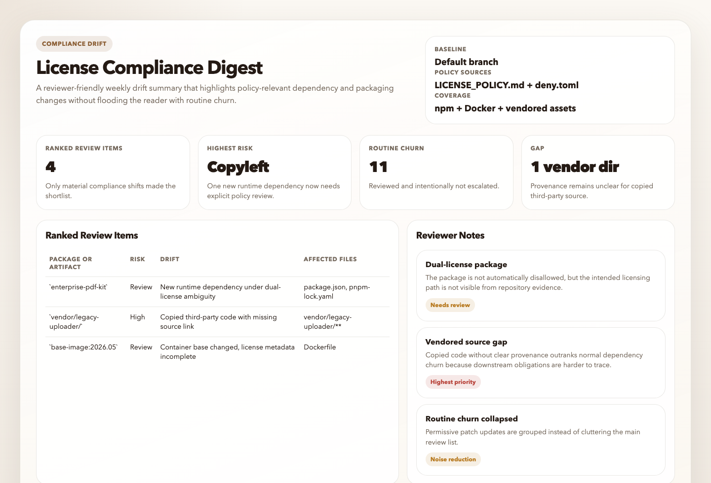
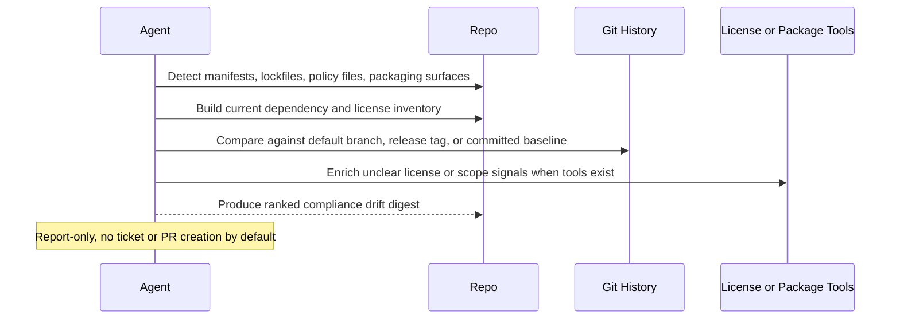

# License Compliance Drift Digest

## Overview

This automation checks dependency license changes and highlights the ones most likely to matter for compliance. It is a quick review step for teams that track license risk.
## Preview



Use it when you want a recurring answer to "did anything in this repo's dependency or distribution surface change in a way that needs compliance review?" rather than a generic license inventory.

## How It Works

1. Detects the repository's dependency ecosystems, manifests, lockfiles, workspace files, and container or packaging surfaces.
2. Builds a current dependency and license inventory from repository evidence first, then uses available package-manager, license-scanner, registry, or GitHub data only as supporting enrichment.
3. Chooses the best available comparison baseline, preferring committed policy or baseline files, then the default branch, then the latest release tag.
4. Identifies meaningful changes such as new runtime dependencies, unknown or changed licenses, dual-license ambiguity, vendored code with unclear provenance, or policy-relevant drift.
5. Ranks only the items that look worth human review and returns one concise digest with evidence, affected manifests, and recommended next actions.



## When To Use It

- you want a weekly or release-adjacent compliance digest for the current repository
- you want dependency and license changes ranked by business relevance, not just listed
- you want repository evidence used before escalating a change
- you want a safer first pass than a hard-fail gate on every unknown or copyleft string

## Prerequisites

- Repository read access with `git` available for baseline comparison
- `rg` for bounded repository inspection
- Optional package-manager, license-tool, or GitHub access if you want stronger inventory quality

The automation still works in repo-only mode. It should degrade to a narrower report rather than guessing.

## Cursor Cloud Usage

1. Open [Cursor Automations](https://cursor.com/automations/new).
2. Name your automation and paste [license-compliance-drift-digest.md](/Users/adamchmara/projects/ai-agent-automations/automations/license-compliance-drift-digest/license-compliance-drift-digest.md) as the automation prompt.
3. Make sure the runtime can read the repository and execute `git` and `rg`.
4. Optionally provide package-manager, license-tool, GitHub, or Slack access if you want richer evidence or delivery.
5. Set the schedule or run manually, then save the automation.

## Codex App Usage

1. Click `Automation` > `New Automation`.
2. Name your automation and paste [license-compliance-drift-digest.md](/Users/adamchmara/projects/ai-agent-automations/automations/license-compliance-drift-digest/license-compliance-drift-digest.md) as the automation prompt.
3. Make sure the runtime can inspect the repository and run `git` and `rg`.
4. Optionally add the GitHub plugin or allow existing package-manager and license tooling in the environment for stronger evidence.
5. Set the schedule or run manually and save the automation.

## Claude Code / Codex CLI / Copilot Usage

1. Start the agent in the repository you want reviewed.
2. Make sure the runtime can execute `git` and `rg`. Optional package-manager, license, GitHub, or container tooling improves evidence quality but is not required.
3. For repeated checks in an open Claude Code session, use `/loop`, for example:

```text
/loop 1w Follow the instructions in automations/license-compliance-drift-digest/license-compliance-drift-digest.md
```

4. For durable Claude-managed automation outside the current session, use `/schedule` or create a Routine in `claude.ai/code/routines`.

## Recommended Defaults

| Setting | Default |
| --- | --- |
| Scope | `current repository only` |
| Baseline order | `committed policy or baseline file, then default branch, then latest release tag` |
| Evidence priority | `manifests and lockfiles first, then local tool output, then registry or GitHub enrichment` |
| Ecosystems | `auto-detect common package-manager and container surfaces` |
| Ranked review items | `up to 10` |
| Output | `Markdown digest with optional static HTML artifact` |
| Writes | `none` |

Keep the run conservative: prefer direct dependency and runtime-path changes over dev-only churn, treat unknown license signals as review items rather than automatic violations, and say clearly when the run is baseline-limited.

## Prompt Inputs

Add context only when policy or scope cannot be inferred cleanly from the repo, for example:

```text
Use LICENSE_POLICY.md and .github/dependency-review-config.yml as the authoritative policy.
Focus on production services and publishable packages.
Ignore docs examples, internal playgrounds, sample apps, fixture lockfiles, and archived packages.
Treat this repository as distributed customer software, not an internal-only service.
```

## Docs

- [Codex Automations](https://openai.com/academy/codex-automations)
