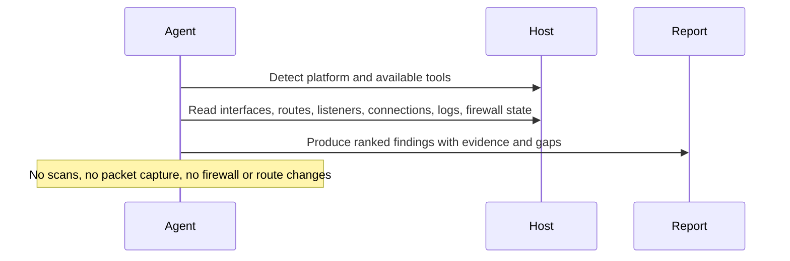

# Local Network Monitor

## Overview

This automation reviews the current network state of a machine and produces a compact evidence-based summary. It is for quick situational awareness, not deep forensics.
## How It Works

1. Detects the local platform and available read-only tooling, preferring `osquery` when installed.
2. Collects interface, route, DNS, listener, connection, firewall, and startup-item evidence from the current host.
3. Ranks only meaningful issues, exposure findings, and posture gaps.
4. Uses tightly targeted logs only when a snapshot finding justifies the follow-up.
5. Returns one short Markdown report, or a partial report when some sources are unreadable.



## Prerequisites

- The automation must run on the machine being inspected, or in an environment that can execute local shell commands on that machine
- Read access to network state and recent system logs
- Optional `osquery` for more consistent cross-platform output

## Optional Host Tooling

Install `osquery` on the target host if you want stronger socket, listener, and startup-item coverage.

macOS example:

```bash
brew install --cask osquery
osqueryi --json "select * from os_version;"
```

Linux example:

```bash
sudo apt-get install osquery
osqueryi --json "select * from os_version;"
```

If `osquery` is unavailable, the automation still works, but listener, socket, and startup-context coverage is weaker.

## Cursor Cloud Usage

1. Open [Cursor Automations](https://cursor.com/automations/new).
2. Name your automation and paste [local-network-monitor.md](/Users/adamchmara/projects/ai-agent-automations/automations/local-network-monitor/local-network-monitor.md) as the automation prompt.
3. Make sure the runner is attached to the host you want to inspect. A generic hosted sandbox will inspect itself, not your laptop or server.
4. No MCP setup is required. Optionally install `osquery` on the host for better portability across macOS and Linux.
5. Set the schedule or run manually, then save the automation.

## Codex App Usage

1. Click `Automation` > `New Automation`.
2. Name your automation and paste [local-network-monitor.md](/Users/adamchmara/projects/ai-agent-automations/automations/local-network-monitor/local-network-monitor.md) as the automation prompt.
3. Run it only in a Codex environment that has shell access to the machine you want to inspect.
4. No MCP setup is required. Optionally install `osquery` on the host for more consistent interface, route, and socket discovery.
5. Set the schedule or run manually and save the automation.

## Claude Code / Codex CLI / Copilot Usage

1. No extra MCP setup is required for the core workflow.
2. Start the agent session on the host you want to inspect, or in a remote shell environment that can read that host's local network state and logs.
3. For repeated checks in an open Claude Code session, use `/loop`, for example:

```text
/loop 1d Follow the instructions in automations/local-network-monitor/local-network-monitor.md
```

4. For durable Claude-managed automation, use `/schedule` or create a Routine in `claude.ai/code/routines`.
5. In Codex CLI or Copilot coding-agent environments, schedule this only if the runtime stays attached to the target host between runs.

## Recommended Defaults

| Setting | Default |
| --- | --- |
| Host scope | `current machine only` |
| Platform | `auto-detect macOS or Linux` |
| Log review | `disabled by default; targeted follow-up only` |
| Interface scope | `all non-loopback interfaces` |
| Connection review | `bounded sample of established external connections` |
| Firewall mode | `inspect only` |
| Startup context | `include when the host tooling already exposes it` |
| Baseline mode | `none unless explicitly provided` |
| Output | `Markdown report` |

Keep the run conservative: prefer `osquery` when available, do not query logs by default, call out firewall or log visibility gaps explicitly, and keep common developer listeners or routine tunnel churn out of ranked findings unless stronger evidence supports them.

## Prompt Inputs

Add context only when the host baseline is not obvious, for example:

```text
Focus on en0, utun*, and the default route. Treat Docker bridge interfaces as low priority unless they show repeated errors or unexpected listeners.
Expected listeners: ssh on 22, Tailscale on 41641/udp, local Postgres on 5432 bound to loopback only.
Do not rank browser or package-manager egress unless it is long-lived, repeatedly failing, or connecting to unexpected countries or networks.
If you find a new non-loopback listener or repeated connection failures, include one concrete follow-up command to run manually before any system changes.
```

## Docs

- [Codex Automations](https://openai.com/academy/codex-automations)
