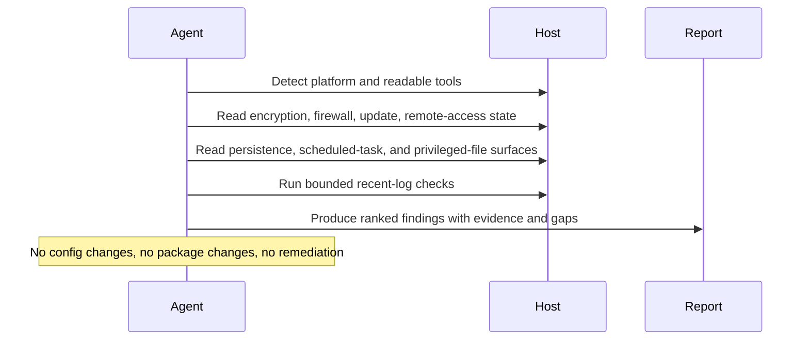

# Local Security Monitor

## Overview

This automation performs a bounded security review of a local host and highlights the issues most likely to matter. It is a general local posture check.
## How It Works

1. Detects the local platform and available read-only tooling, preferring native OS signals first.
2. Collects core posture evidence for encryption, firewall state, update coverage, and remote-access posture.
3. Reviews startup, scheduled-task, SSH, and privileged-binary surfaces when they are readable.
4. Uses tightly bounded recent-log checks only when reliable local log sources are available.
5. Returns one short Markdown report with ranked findings, evidence, confidence, and explicit coverage gaps.



## Prerequisites

- The automation must run on the machine being inspected, or in an environment that can execute local shell commands on that machine
- Read access to local security posture sources, readable config files, and recent system logs
- Optional `osquery` for more consistent cross-platform reads of startup items, scheduled tasks, SSH config, and privileged binaries

## Optional Host Tooling

Install `osquery` on the target host if you want stronger surface coverage.

macOS example:

```bash
brew install --cask osquery
osqueryi --json "select * from os_version;"
```

Linux example:

```bash
sudo apt-get install osquery
osqueryi --json "select * from os_version;"
```

If `osquery` is unavailable, the automation still works with native commands.

## Cursor Cloud Usage

1. Open [Cursor Automations](https://cursor.com/automations/new).
2. Name your automation and paste [local-security-monitor.md](/Users/adamchmara/projects/ai-agent-automations/automations/local-security-monitor/local-security-monitor.md) as the automation prompt.
3. Make sure the runner is attached to the host you want to inspect. A generic hosted sandbox will inspect itself, not your laptop or server.
4. No MCP setup is required. Optionally install `osquery` on the host for more consistent startup, SSH, and privileged-surface inspection.
5. Set the schedule or run manually, then save the automation.

## Codex App Usage

1. Click `Automation` > `New Automation`.
2. Name your automation and paste [local-security-monitor.md](/Users/adamchmara/projects/ai-agent-automations/automations/local-security-monitor/local-security-monitor.md) as the automation prompt.
3. Run it only in a Codex environment that has shell access to the machine you want to inspect.
4. No MCP setup is required. Optionally install `osquery` on the host for more consistent cross-platform surface coverage.
5. Set the schedule or run manually and save the automation.

## Claude Code / Codex CLI / Copilot Usage

1. No extra MCP setup is required for the core workflow.
2. Start the agent session on the host you want to inspect, or in a remote shell environment that can read that host's local security state and logs.
3. For repeated checks in an open Claude Code session, use `/loop`, for example:

```text
/loop 1d Follow the instructions in automations/local-security-monitor/local-security-monitor.md
```

4. For durable Claude-managed automation, use `/schedule` or create a Routine in `claude.ai/code/routines`.
5. In Codex CLI or Copilot coding-agent environments, schedule this only if the runtime stays attached to the target host between runs.

## Recommended Defaults

| Setting | Default |
| --- | --- |
| Host scope | `current machine only` |
| Platform | `auto-detect macOS or Linux` |
| Tooling mode | `native commands first; use osquery or lynis only if present` |
| Log window | `last 24 hours, bounded and security-relevant only` |
| Update review | `OS and distro-native security-update posture only` |
| Persistence review | `startup items, scheduled tasks, SSH posture, privileged binaries when readable` |
| Mutation policy | `report only` |
| Output | `Markdown report` |

Keep the run conservative: prefer native OS signals over generic checklists, treat `osquery` as optional, keep the ranked findings list short, and call out unreadable core sources as explicit coverage gaps.

## Prompt Inputs

Add context only when the host baseline is not obvious, for example:

```text
Expected remote-access surfaces: ssh on 22/tcp for this host, no screen sharing, no remote desktop, no AirPlay receiver.
Expected startup items include Tailscale, a corporate endpoint agent, and Docker Desktop.
For Linux update posture, focus on distro-native security updates only.
If you find a new remote-access service, writable privileged file, or disabled firewall, include one concrete manual verification command before suggesting a hardening step.
```

## Docs

- [Codex Automations](https://openai.com/academy/codex-automations)
