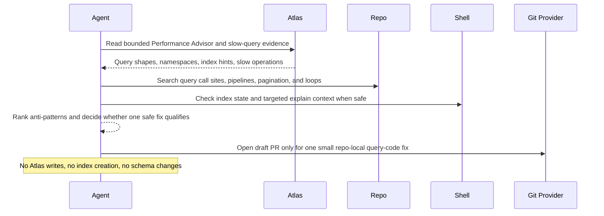

# MongoDB Query Anti-Pattern Scout

## Overview

This automation combines Atlas signals with repository code search to spot MongoDB query patterns that may hurt performance or reliability. It helps teams find the code paths most worth fixing.
## How It Works

1. Requires a small run-configuration block with explicit Atlas project and cluster only.
2. Reads Atlas evidence such as Performance Advisor suggestions and slow-query signals for the scoped cluster.
3. Searches the current repository for high-risk MongoDB patterns such as broad scans, regex misuse, large `$lookup` paths, high-volume negative predicates, missing projections, large `skip` pagination, N+1 query loops, and expensive aggregation shapes.
4. Correlates code paths with Atlas evidence, index state, and lightweight explain or usage context when available.
5. Returns one ranked anti-pattern report.
6. Opens a draft PR only when the operator explicitly allows it and exactly one narrow query-code fix in the current repository is clearly safe, localized, and testable.



## When To Use It

- you want Atlas evidence tied back to actual repository query paths
- you want a ranked list of MongoDB anti-patterns instead of raw slow-query output
- you want optional automation for one small safe query-code fix, not automatic indexing or schema churn
- you want repeated performance hygiene review for a repo that owns MongoDB query code

## Prerequisites

- MongoDB access through the MongoDB MCP server or the official Atlas CLI plus `mongosh`
- Atlas access with enough permission to read Performance Advisor and slow-query evidence for the scoped cluster
- an M10+ Atlas cluster if you want Performance Advisor evidence
- repository access in the workspace, or GitHub code search if the repo is not present locally
- validation commands for the affected service or package if you want automatic draft PR creation
- GitHub or equivalent PR tooling if you want automatic draft PR creation

## Cursor Cloud Usage

1. Open [Cursor Automations](https://cursor.com/automations/new).
2. Name your automation and paste [mongodb-query-anti-pattern-scout.md](/Users/adamchmara/projects/ai-agent-automations/automations/mongodb-query-anti-pattern-scout/mongodb-query-anti-pattern-scout.md) as the automation prompt.
3. Add the MongoDB MCP server, or make the Atlas CLI and `mongosh` available in the runtime.
4. Make sure the runtime can read the current repository or otherwise search the relevant GitHub code.
5. Fill in the Atlas project and cluster in the prompt, then set the schedule or run manually and save the automation.

## Codex App Usage

1. Click `Automation` > `New Automation`.
2. Name your automation and paste [mongodb-query-anti-pattern-scout.md](/Users/adamchmara/projects/ai-agent-automations/automations/mongodb-query-anti-pattern-scout/mongodb-query-anti-pattern-scout.md) as the automation prompt.
3. Install the MongoDB MCP server, or make `atlas` and `mongosh` available in the runtime.
4. Make sure the environment can read the current repository, or provide GitHub search access if the repo is not present locally.
5. Fill in the Atlas project and cluster in the prompt, set the schedule or run manually, and save the automation.

## Claude Code / Codex CLI / Copilot Usage

1. Add the MongoDB MCP server, or make `atlas` and `mongosh` available in the runtime.
2. Make sure the runtime can read the target repository or otherwise search the relevant GitHub code.
3. Fill in the Atlas project and cluster before scheduling repeated runs.
4. For repeated checks in an open Claude Code session, use `/loop`, for example:

```text
/loop 1w Follow the instructions in automations/mongodb-query-anti-pattern-scout/mongodb-query-anti-pattern-scout.md
```

5. For durable Claude-managed automation, use `/schedule` or create a Routine in `claude.ai/code/routines`.

## CLI Setup

```bash
brew install mongodb-atlas-cli
brew install mongosh
atlas auth login
```

## Recommended Defaults

| Setting | Default |
| --- | --- |
| Atlas project scope | `required in run configuration` |
| Atlas cluster scope | `required in run configuration` |
| Current review window | `last 7 days` |
| Repository scope | `current repository when available` |
| Comparison window | `previous 7 days when it helps, otherwise none` |
| Namespace allowlist | `all visible namespaces unless explicitly narrowed` |
| First-pass candidate cap | `top 30 query shapes or code candidates` |
| Final ranked findings | `top 8` |
| Mutation mode | `report-only by default` |
| PR behavior | `report-only unless the operator explicitly allows draft PRs` |

Keep the run conservative: treat Atlas as evidence of database stress rather than proof of one code cause, downgrade confidence when query fields are redacted or repo ownership is unclear, and keep schema changes, index creation, and migrations out of scope.

## Prompt Inputs

Add context only when Atlas and repo inspection are not enough, for example:

```text
Allowed Atlas project(s): checkout-prod
Allowed Atlas cluster(s): checkout-primary
Only inspect namespaces owned by this repository: app.orders, app.customers, app.sessions
Prioritize services/api, packages/data-access, and db/query-builders.
Allow draft PR for behavior-preserving query-code fixes only.
```

## Docs

- [MongoDB MCP Server](https://www.mongodb.com/docs/mcp-server/)
- [Atlas Performance Advisor](https://www.mongodb.com/docs/atlas/performance-advisor/)
- [Codex Automations](https://openai.com/academy/codex-automations)
