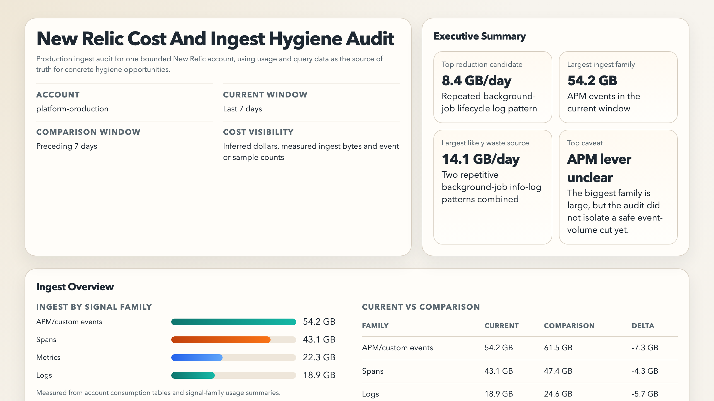
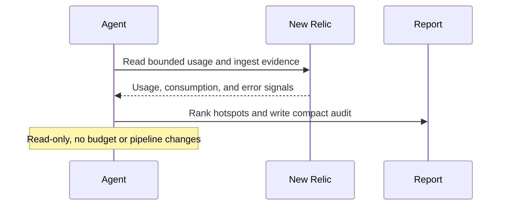

# New Relic Cost And Ingest Hygiene Audit

## Overview

This automation reviews one New Relic account and highlights the biggest sources of ingest waste and avoidable telemetry cost. It helps teams clean up noisy or expensive monitoring.
## Preview



## How It Works

1. Requires a completed run-configuration block with explicit account scope and time window.
2. Reads the best available ingest and usage surfaces for the current and optional comparison windows.
3. Ranks the biggest cost or noise hotspots across logs, spans, metrics, events, partitions, or integration errors.
4. Returns one compact Markdown audit with a hotspot ledger, concrete reduction candidates, and the highest-value next actions.
5. Produces an optional HTML report with charts and candidate cards for the most important surfaces.
6. If it cannot identify a concrete lever inside a large surface, it should say that directly instead of pretending the surface itself is already actionable.



## When To Use It

- you want a recurring view of New Relic ingest pressure and telemetry waste
- you want to spot log, span, metric, or custom-event sources that are disproportionate or newly noisy
- you want one compact account-level audit instead of manually digging through usage screens
- you want likely reduction opportunities, not just ingest rankings

## Prerequisites

- New Relic access through MCP or the New Relic CLI
- Permission to read the account usage, ingest, and query surfaces you care about

Use a least-privilege New Relic account or API key. The public MCP server is a preview feature and should not be used for FedRAMP- or HIPAA-regulated accounts.

## Cursor Cloud Usage

1. Open [Cursor Automations](https://cursor.com/automations/new).
2. Name your automation and paste [new-relic-cost-and-ingest-hygiene-audit.md](/Users/adamchmara/projects/ai-agent-automations/automations/new-relic-cost-and-ingest-hygiene-audit/new-relic-cost-and-ingest-hygiene-audit.md) as the automation prompt.
3. Add the New Relic MCP server.
   - US accounts: `https://mcp.newrelic.com/mcp/`
   - EU accounts: `https://mcp.eu.newrelic.com/mcp/`
4. Complete the OAuth flow or configure your environment for the official CLI alternative.
5. Set the schedule or run manually, then save the automation.

## Codex App Usage

1. Click `Automation` > `New Automation`.
2. Name your automation and paste [new-relic-cost-and-ingest-hygiene-audit.md](/Users/adamchmara/projects/ai-agent-automations/automations/new-relic-cost-and-ingest-hygiene-audit/new-relic-cost-and-ingest-hygiene-audit.md) as the automation prompt.
3. Install the New Relic MCP server or make the official New Relic CLI available in the runtime.
4. Set the schedule or run manually and save the automation.

## Claude Code / Codex CLI / Copilot Usage

1. Add the New Relic MCP server, or make the official New Relic CLI available in the runtime.
2. Make sure the environment can read the account usage and query surfaces you expect.
3. For repeated checks in an open Claude Code session, use `/loop`, for example:

```text
/loop 1w Follow the instructions in automations/new-relic-cost-and-ingest-hygiene-audit/new-relic-cost-and-ingest-hygiene-audit.md
```

4. For durable Claude-managed automation, use `/schedule` or create a Routine in `claude.ai/code/routines`.

## CLI Setup

```bash
brew install newrelic-cli
newrelic profile add
```

## Recommended Defaults

| Setting | Default |
| --- | --- |
| Account scope | `required in run configuration` |
| Current window | `required in run configuration` |
| Comparison window | `optional in run configuration` |
| First-pass hotspot cap | `top 20 surfaces by ingest pressure` |
| Final spotlight count | `top 5 findings` |
| Delivery | `Markdown audit plus standalone HTML report artifact` |

Keep the run conservative: prefer repeated high-volume, low-signal telemetry over one-day spikes, label cost pressure as inferred when exact cost is unavailable, and prefer specific patterns over service-level totals.

## Prompt Inputs

Add context only when the account scope or priorities are not obvious, for example:

```text
Allowed New Relic account(s): platform-production
Environment: production
Current audit window: last 7 days
Comparison window: preceding 7 days
Priority signal families: logs, spans, custom events
```

Add policy only when needed, for example: prioritize logs and custom events over infrastructure metrics, and name repeated message templates or logger categories instead of stopping at service totals.

## Docs

- [Set up New Relic MCP](https://docs.newrelic.com/docs/agentic-ai/mcp/setup/)
- [New Relic CLI](https://docs.newrelic.com/docs/new-relic-solutions/tutorials/new-relic-cli/)
- [Codex Automations](https://openai.com/academy/codex-automations)
