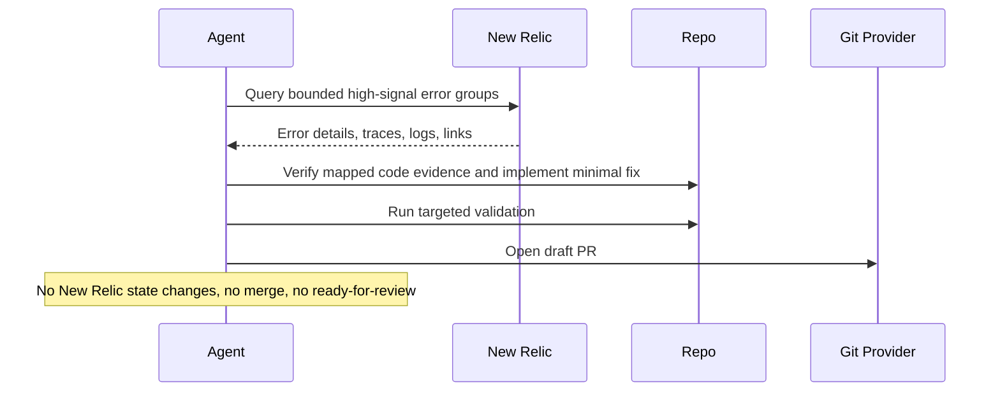

# New Relic Error Fixer

## Overview

This automation picks one important production error from New Relic, traces it back to the code when safe, and prepares a small fix. It is for focused incident follow-through.
## How It Works

1. Queries New Relic for a bounded set of recent high-signal unexpected or resurfacing error groups.
2. Requires a bounded service, entity, or workload scope, then ranks candidates and selects at most one error with clear mapping to the current repository, editable in-app code, and available validation commands.
3. Verifies the root-cause hypothesis in the local codebase, implements the smallest safe fix, and adds a targeted regression test when feasible.
4. Runs validation and opens a draft PR, or stops with a reviewable investigation report if the fix cannot be validated safely.



## Prerequisites

- New Relic access through MCP or the New Relic CLI
- Repository access in the workspace where the fix will be made
- Validation commands for the affected app, package, or service
- GitHub or equivalent PR tooling if you want automatic draft PR creation

Use a least-privilege New Relic account or API key. The public MCP server is a preview feature and should not be used for FedRAMP- or HIPAA-regulated accounts.

## Cursor Cloud Usage

1. Open [Cursor Automations](https://cursor.com/automations/new).
2. Name your automation and paste [new-relic-error-fixer.md](/Users/adamchmara/projects/ai-agent-automations/automations/new-relic-error-fixer/new-relic-error-fixer.md) as the automation prompt.
3. Add trigger conditions.
4. Add the New Relic MCP server.
   - US accounts: `https://mcp.newrelic.com/mcp/`
   - EU accounts: `https://mcp.eu.newrelic.com/mcp/`
5. Complete the OAuth flow if your Cursor setup supports it, or configure an API key header if your MCP client uses header-based auth.
6. Add the `Open Pull Request` tool, or let the agent use an existing GitHub CLI or plugin in the environment.
7. Make sure the runtime can execute the validation commands required for the mapped repository.
8. Click `Create`.

## Codex App Usage

1. Install the New Relic MCP server in Codex.
   - OAuth:
```bash
codex mcp add new-relic-mcp-server --url "https://mcp.newrelic.com/mcp/"
```
   - EU accounts should replace the URL with `https://mcp.eu.newrelic.com/mcp/`.
2. If you prefer API-key auth, configure it in `~/.codex/config.toml`:
   ```toml
   [mcp_servers.new-relic]
   url = "https://mcp.newrelic.com/mcp/"
   env_http_headers = { "api-key" = "NEW_RELIC_API_KEY" }
   ```
3. Run Codex and complete `/mcp` authentication if needed.
4. Click `Automation` > `New Automation`.
5. Name your automation and paste [new-relic-error-fixer.md](/Users/adamchmara/projects/ai-agent-automations/automations/new-relic-error-fixer/new-relic-error-fixer.md) as the automation prompt.
6. Set the schedule or run manually and save the automation.
7. Add the GitHub plugin to Codex, or let Codex use an existing GitHub CLI or tool in the environment.

## Claude Code Usage

1. Add the New Relic MCP server in Claude Code.
   - OAuth:
```bash
claude mcp add newrelic --transport http https://mcp.newrelic.com/mcp/
```
   - API key:
```bash
claude mcp add newrelic https://mcp.newrelic.com/mcp/ --transport http --header "Api-Key: NRAK-YOUR-KEY-HERE"
```
   - EU accounts should replace the URL with `https://mcp.eu.newrelic.com/mcp/`.
2. Run `claude mcp list` to confirm the server is configured.
3. Open Claude Code and run `/mcp` to authenticate with New Relic in your browser when using OAuth.
4. Make sure the runtime can work in the affected repository and run the required validation commands.
5. For repeated checks in an open Claude Code session, use `/loop`, for example:

```text
/loop weekdays at 11am Follow the instructions in automations/new-relic-error-fixer/new-relic-error-fixer.md
```

6. For durable Claude-managed automation that survives outside the current session, use `/schedule` or create a Routine in `claude.ai/code/routines`.
7. Make sure the runtime has repository write access and PR creation access if you want automatic draft PRs.

## CLI Setup

```bash
brew install newrelic-cli
newrelic profile add
```

Use the CLI path when your runner can reliably execute bounded NRQL or NerdGraph queries and MCP is unavailable or undesirable.

## Recommended Defaults

| Setting | Default |
| --- | --- |
| Query window | `24h` |
| Candidate pool size | `10` |
| Max root causes fixed per run | `1` |
| Signals | `unexpected`, `resurfacing`, `high recurrence`, `high recent impact` |
| PR mode | `draft-pr` |
| Branch | `fix/new-relic-error-fixer-YYYY-MM-DD` |
| Commit message | `fix: address mapped New Relic error` |

Keep the run conservative: prefer a local evidence-backed fix over speculative cleanup, stop if scope or repository mapping is ambiguous, skip expected noise and external failures, and keep any PR as a draft.

## Prompt Inputs

Add context only when New Relic state alone is not enough, for example:

```text
New Relic workload: checkout-production
Entities: checkout-api
Environment: production
Exclude expected 4xx validation errors, expected auth failures, and rate-limit behavior.
Do not touch auth, billing, migrations, data backfills, or infrastructure code.
```

## Docs

- [Set up New Relic MCP](https://docs.newrelic.com/docs/agentic-ai/mcp/setup/)
- [New Relic CLI](https://docs.newrelic.com/docs/new-relic-solutions/tutorials/new-relic-cli/)
- [Codex Automations](https://openai.com/academy/codex-automations)
