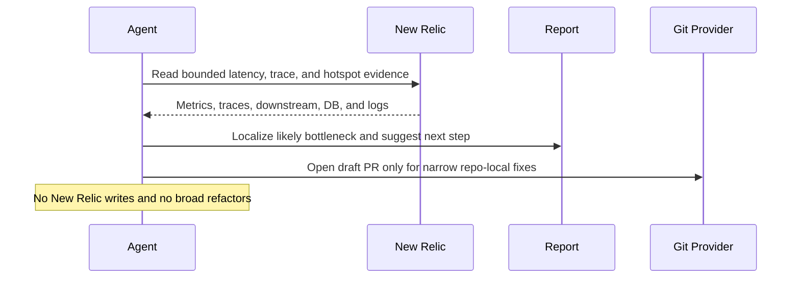

# New Relic Latency Hotspot Fixer

## Overview

This automation looks for a meaningful latency hotspot in New Relic, identifies the likely code path, and prepares a narrow improvement when justified. It is for targeted performance fixes.
## How It Works

1. Requires a completed run-configuration block with explicit account, service scope, and time window.
2. Ranks the strongest current latency hotspots in that bounded scope and uses an optional comparison window only as context.
3. Uses traces, spans, external services, database evidence, and logs-in-context to explain why the chosen path is slow.
4. Opens a draft PR only when the hotspot is clearly caused by a narrow app-side defect in the current repository. Otherwise returns one compact report with a hotspot ledger, explicit no-PR reason, and the smallest useful follow-up.



## When To Use It

- you want the agent to find the slowest important path in a bounded service scope
- you want to know whether the slowdown is app code, dependency, or database
- you want a draft PR only when the hotspot is clearly fixable in the current repo

## Prerequisites

- New Relic access through MCP or the official New Relic CLI
- enough permission to read transaction, trace, and query surfaces for the scoped service
- repository access in the workspace where the fix would be made
- validation commands for the affected app, package, or service
- GitHub or equivalent PR tooling if you want automatic draft PR creation

Use a least-privilege New Relic account or API key. The public MCP server is a preview feature and should not be used for FedRAMP- or HIPAA-regulated accounts.

## Cursor Cloud Usage

1. Open [Cursor Automations](https://cursor.com/automations/new).
2. Name your automation and paste [new-relic-latency-hotspot-fixer.md](/Users/adamchmara/projects/ai-agent-automations/automations/new-relic-latency-hotspot-fixer/new-relic-latency-hotspot-fixer.md) as the automation prompt.
3. Add the New Relic MCP server.
   - US accounts: `https://mcp.newrelic.com/mcp/`
   - EU accounts: `https://mcp.eu.newrelic.com/mcp/`
4. Complete the OAuth flow or configure your environment for the official CLI alternative.
5. Set the schedule or run manually, then save the automation.

## Codex App Usage

1. Click `Automation` > `New Automation`.
2. Name your automation and paste [new-relic-latency-hotspot-fixer.md](/Users/adamchmara/projects/ai-agent-automations/automations/new-relic-latency-hotspot-fixer/new-relic-latency-hotspot-fixer.md) as the automation prompt.
3. Install the New Relic MCP server or make the official New Relic CLI available in the runtime.
4. Set the schedule or run manually and save the automation.

## Claude Code / Codex CLI / Copilot Usage

1. Add the New Relic MCP server, or make the official New Relic CLI available in the runtime.
2. Make sure the environment can read traces, transactions, and related query data for the scoped target.
3. For repeated checks in an open Claude Code session, use `/loop`, for example:

```text
/loop 1d Follow the instructions in automations/new-relic-latency-hotspot-fixer/new-relic-latency-hotspot-fixer.md
```

4. For durable Claude-managed automation, use `/schedule` or create a Routine in `claude.ai/code/routines`.

## CLI Setup

```bash
brew install newrelic-cli
newrelic profile add
```

## Recommended Defaults

| Setting | Default |
| --- | --- |
| Scope | `one explicit account and service or entity, required` |
| Current window | `required in run configuration` |
| Comparison window | `optional in run configuration` |
| Preferred signal | `p95 or p99 latency with throughput context` |
| Delivery | `draft PR for high-confidence app-side fixes, otherwise Markdown investigation` |

Keep the run conservative: prefer latency percentiles over averages, stop if the scope is ambiguous, open a draft PR only for localized app-side fixes with clear evidence, and keep instrumentation-only changes report-only unless explicitly allowed.

## Prompt Inputs

Add context only when the scope or interpretation policy is not obvious, for example:

```text
Allowed New Relic account(s): platform-production
Allowed service(s) or entity name(s): checkout-api
Environment: production
Current hotspot window: last 24 hours
Comparison window: preceding 7 days
Allow instrumentation-only PRs when no direct fix is justified: no
```

## Docs

- [Set up New Relic MCP](https://docs.newrelic.com/docs/agentic-ai/mcp/setup/)
- [New Relic CLI](https://docs.newrelic.com/docs/new-relic-solutions/tutorials/new-relic-cli/)
- [Codex Automations](https://openai.com/academy/codex-automations)
