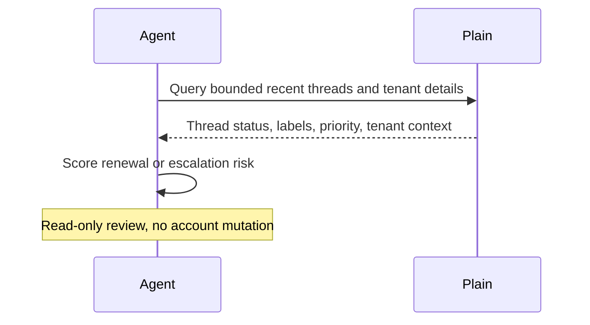

# Plain Renewal Risk Digest

## Overview

This automation looks for support patterns that may signal renewal risk, churn risk, or account frustration. It helps success teams focus on the accounts that may need attention.
## Preview


## How It Works

1. Reads a bounded set of recent support threads and tenant details from Plain.
2. Resolves real tenant and customer display names when the workspace exposes them, plus representative thread links and owners.
3. Looks for repeated negative signals such as unresolved pain, escalations, priority spikes, repeated reopenings, billing shock, downgrade pressure, or concentrated issue volume.
4. If Stripe is available and account matching is reliable, enriches the support signals with subscription, invoice, refund, dispute, failed-payment, contraction, or cancellation context.
5. Ranks only the clearest at-risk tenants or thread clusters.
6. Produces one compact risk digest and stops short of making any customer-facing or system-facing changes.



## When To Use It

- weekly CSM or support-lead risk review
- pre-renewal account health review
- escalation watch for high-value tenants
- support-driven churn signal detection

## Prerequisites

- Plain access through the official MCP server
- Reliable tenant or account context in Plain
- Optional Stripe access if you want commercial enrichment that separates support pain from true renewal risk

## Cursor Cloud Usage

1. Open [Cursor Automations](https://cursor.com/automations/new).
2. Name your automation and paste [plain-renewal-risk-digest.md](/Users/adamchmara/projects/ai-agent-automations/automations/plain-renewal-risk-digest/plain-renewal-risk-digest.md) as the automation prompt.
3. Add the Plain MCP server at `https://mcp.plain.com/mcp` and complete the OAuth flow.
4. Optionally add a short workspace note if you want to narrow scope to enterprise, strategic, or renewal-sensitive tenants.
5. Save the automation.

## Codex App Usage

1. Install the Plain MCP server in Codex:
  ```bash
  codex mcp add plain -- npx -y mcp-remote https://mcp.plain.com/mcp
  codex mcp list
  ```
2. If Stripe is available in your Codex environment, leave it connected so the automation can enrich support-driven risk with subscription and billing context when matching is reliable.
3. Click `Automation` > `New Automation`.
4. Name your automation and paste [plain-renewal-risk-digest.md](/Users/adamchmara/projects/ai-agent-automations/automations/plain-renewal-risk-digest/plain-renewal-risk-digest.md) as the automation prompt.
5. Optionally add a short workspace note if you want to narrow scope to enterprise, strategic, or renewal-sensitive tenants.
6. Set the schedule or run manually and save the automation.

## Claude Code Usage

1. Add the Plain MCP server in Claude Code:
  ```bash
  claude mcp add --transport http plain https://mcp.plain.com/mcp
  claude mcp list
  ```
2. Open Claude Code and run `/mcp` to authenticate with Plain.
3. Optionally prepend a short workspace note if you want to narrow scope to enterprise, strategic, or renewal-sensitive tenants.
4. For repeated checks in an open Claude Code session, use `/loop`, for example:

```text
/loop 1w Follow the instructions in automations/plain-renewal-risk-digest/plain-renewal-risk-digest.md
```

5. For durable Claude-managed automation, use `/schedule` or create a Routine in `claude.ai/code/routines`.

## Recommended Defaults

| Setting | Default |
| --- | --- |
| Review window | `last 14 days` |
| First-pass candidate pool | `up to 40 threads` |
| Final risk list | `up to 10 tenants or thread clusters` |
| Default scope | `customer-facing tenant-linked activity with obvious noise excluded` |
| Preferred identity output | `tenant name, customer name, owner, and thread links when available` |
| Commercial enrichment | `use Stripe only when account matching is reliable` |
| Delivery mode | `preview output with optional static HTML artifact` |
| Write mode | `read-only` |

Keep the run conservative: start with manual review, prefer repeated evidence over sentiment alone, use Stripe only to confirm business significance, and use watchlist language when account importance or timing is unclear.

## Prompt Inputs

Add context only when scope or risk policy cannot be inferred cleanly, for example:

```text
Only evaluate enterprise and mid-market tenants.
Ignore free workspaces, sandbox tenants, and internal accounts.
Treat repeated unresolved bugs, multiple reopenings within 14 days, urgent threads, and explicit churn language as strong signals.
If Stripe matching is ambiguous, skip Stripe enrichment instead of guessing.
```

## Docs

- [Plain MCP Server](https://help.plain.com/article/mcp-server)
- [Codex Automations](https://openai.com/academy/codex-automations)
