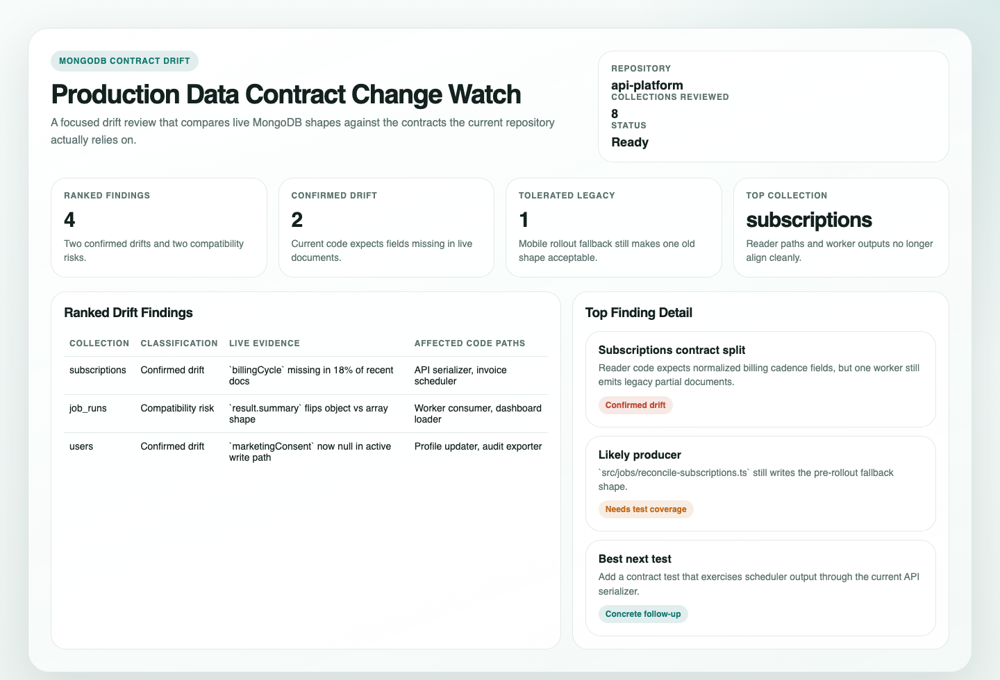

# Production Data Contract Change Watch

## Overview

This automation compares production MongoDB document shapes against the data contracts implied by your codebase. It helps teams catch drift before it causes bugs.
## Preview



Use it when you want a recurring answer to "does production data still match what the code expects?" rather than a generic schema dump.

## How It Works

1. Resolves the current repository and one production or production-like MongoDB data source.
2. Searches the repo for contract surfaces such as validators, parsers, serializers, model definitions, and data-access boundaries.
3. Prioritizes collections that matter to current code paths instead of scanning everything equally.
4. Uses bounded schema inspection or sampling to compare live shapes against code expectations.
5. Ranks only the mismatches that look materially risky and returns affected code paths, likely producers, and test ideas.
6. Opens a draft PR only if one finding maps to a narrow code-side compatibility or validation fix.

```mermaid
sequenceDiagram
    participant Agent
    participant Repo
    participant Mongo as MongoDB
    participant Tests as Existing Tests

    Agent->>Repo: Map collections to validators, handlers, jobs, and frontend readers
    Agent->>Mongo: Inspect bounded live schema evidence
    Agent->>Repo: Compare live fields and shapes to code expectations
    Agent->>Tests: Check existing targeted tests when useful
    Agent-->>Repo: Produce ranked drift report and maybe one draft PR
    Note over Agent: MongoDB stays read-only; repo write path is optional and narrow
```

## When To Use It

- schema-affecting changes landed and you want a production-reality check
- legacy clients, jobs, or integrations may still write older shapes
- readers or validators may assume fields that production data does not always contain
- you want test ideas or one small code-side fix grounded in live drift evidence

## Prerequisites

- Repository read access and a runtime that can inspect the current repo with `git` and `rg`
- Read-only access to one production or production-like MongoDB database through MongoDB MCP or `mongosh`
- Optional targeted test commands if you want the run to confirm a finding with existing validation
- Repository write access plus git and PR tooling if you want the optional draft PR path

Keep live reads bounded. If the automation cannot identify one trustworthy live data source for the repo, it should stop instead of guessing.

## Cursor Cloud Usage

1. Open [Cursor Automations](https://cursor.com/automations/new).
2. Name your automation and paste [production-data-contract-change-watch.md](/Users/adamchmara/projects/ai-agent-automations/automations/production-data-contract-change-watch/production-data-contract-change-watch.md) as the automation prompt.
3. Make sure the runtime can read the current repo and either access MongoDB MCP or execute `mongosh`.
4. Add targeted test commands only if you want extra validation.
5. Add git and PR tooling only if you want the optional draft PR path.
6. Set the schedule or run manually, then save the automation.

## Codex App Usage

1. Make the current repo available in the Codex run environment.
2. Add MongoDB MCP with read-only access to the production or production-like database you want reviewed, or provide `mongosh` in the environment.
3. Click `Automation` > `New Automation`.
4. Paste [production-data-contract-change-watch.md](/Users/adamchmara/projects/ai-agent-automations/automations/production-data-contract-change-watch/production-data-contract-change-watch.md) as the automation prompt.
5. Optionally allow targeted test commands if you want the run to confirm nearby validation coverage.
6. Add git and PR tooling only if you want the narrow repo-fix path.
7. Set the schedule or run manually and save the automation.

## Claude Code / Codex CLI / Copilot Usage

1. Start the agent in the repository you want reviewed.
2. Make one live MongoDB read path available through MongoDB MCP or `mongosh`.
3. Keep the runtime read-only for database access and bounded for collection inspection.
4. Add git, targeted validation commands, and PR tooling only if you want the draft PR path.
5. For repeated checks in an open Claude Code session, use `/loop`, for example:

```text
/loop 1d Follow the instructions in automations/production-data-contract-change-watch/production-data-contract-change-watch.md
```

6. For durable Claude-managed automation outside the current session, use `/schedule` or create a Routine in `claude.ai/code/routines`.

## Recommended Defaults

| Setting | Default |
| --- | --- |
| Scope | `current repository and one production or production-like MongoDB database` |
| Candidate collections | `up to 12` |
| Live evidence | `schema stats first, then bounded sampling when needed` |
| Sampling budget | `up to 100 documents per reviewed collection unless a stronger schema surface exists` |
| Ranked findings | `up to 10` |
| Evidence policy | `field names, types, counts, and redacted examples only` |
| Validation | `existing targeted tests only when clearly relevant` |
| Repo write path | `at most one narrow code-side fix` |
| Output | `Markdown drift report, optional static HTML artifact, plus optional draft PR` |

Keep the interpretation conservative: prefer validators and real parser code over loose type hints, separate confirmed drift from tolerated legacy shapes, and never include full-document dumps or secrets in the report.

## Prompt Inputs

Add context only when the repo or data source has non-obvious boundaries, for example:

```text
Use the app-prod cluster and the app database only.
Prioritize users, organizations, subscriptions, invoices, and job_runs.
Treat src/contracts/, src/routes/, and shared zod schemas as more authoritative than older interface-only types.
Do not open a PR for anything that would require data repair, multi-service rollout, or schema migration planning.
```

## Docs

- [MongoDB MCP Server](https://www.mongodb.com/docs/mcp-server/)
- [mongosh](https://www.mongodb.com/docs/mongodb-shell/)
- [Codex Automations](https://openai.com/academy/codex-automations)
