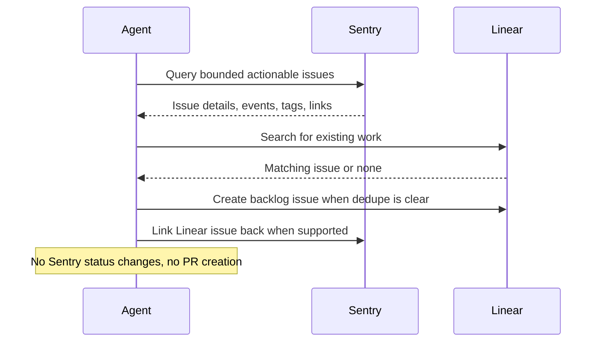

# Sentry Linear Backlog Sync

## Overview

This automation reviews Sentry issues and creates or updates Linear work for the ones worth tracking. It helps teams move recurring production problems into the backlog.
## How It Works

1. Queries Sentry for a bounded set of high-signal unresolved issues such as regressed, escalating, for-review, or high-priority production issues.
2. Expands each candidate with issue evidence, impact, owner hints, and any existing external links.
3. Searches Linear for existing work using the Sentry short ID, permalink, title fingerprint, and stack/context clues.
4. Creates or updates at most a small number of Linear issues, then links the resulting Linear work back to Sentry when that integration path is available.



## Prerequisites

- Sentry access through MCP or [`sentry-cli`](#cli-alternative)
- Linear read and issue-write access through MCP, API, or a connector
- A defined Sentry organization, project, and environment scope

## Cursor Cloud Usage

1. Open [Cursor Automations](https://cursor.com/automations/new).
2. Name your automation and paste [sentry-linear-backlog-sync.md](/Users/adamchmara/projects/ai-agent-automations/automations/sentry-linear-backlog-sync/sentry-linear-backlog-sync.md) as the automation prompt.
3. Add trigger conditions.
4. Click `Add tools or MCP` > `MCP server`.
5. Add the hosted Sentry MCP server at `https://mcp.sentry.dev/mcp` and complete the connection flow.
  - CLI alternative: use [`sentry-cli`](#cli-alternative) in the agent environment instead of steps 4-5.
6. Add Linear access through a Linear MCP server, Linear API tool, or workspace connector that supports issue search and issue creation.
7. Click `Create`.

## Codex App Usage

1. Install the hosted Sentry MCP server in Codex:
  ```bash
  codex mcp add sentry --url https://mcp.sentry.dev/mcp
  codex mcp login sentry
  codex mcp list
  ```
  - CLI alternative: use [`sentry-cli`](#cli-alternative) in the agent environment instead of MCP.
2. Add Linear access in the runner through a connector, MCP server, or API-backed tool that can search and create issues.
3. Click `Automation` > `New Automation`.
4. Name your automation and paste [sentry-linear-backlog-sync.md](/Users/adamchmara/projects/ai-agent-automations/automations/sentry-linear-backlog-sync/sentry-linear-backlog-sync.md) as the automation prompt.
5. Set schedule or run manually and save the automation.

## Claude Code Usage

1. Add the hosted Sentry MCP server in Claude Code:
  ```bash
  claude mcp add --transport http sentry https://mcp.sentry.dev/mcp
  claude mcp list
  ```
  - To share the MCP configuration through the repo, use `--scope project`.
  - CLI alternative: use [`sentry-cli`](#cli-alternative) in the agent environment instead of MCP.
2. Open Claude Code and run `/mcp` to authenticate with Sentry in your browser.
3. Make sure the runtime can search and create Linear issues through MCP, API, or a connector.
4. For repeated checks in an open Claude Code session, use `/loop`, for example:

```text
/loop weekdays at 10am Follow the instructions in automations/sentry-linear-backlog-sync/sentry-linear-backlog-sync.md
```

5. For durable Claude-managed automation that survives outside the current session, use `/schedule` or create a Routine in `claude.ai/code/routines`.

## CLI Alternative

If you prefer not to use MCP for Sentry, `sentry-cli` is a strong fallback.

Install and authenticate it:

```bash
brew install getsentry/tools/sentry-cli
sentry-cli login
```

Useful examples:

```bash
sentry issue list <org>/<project> --query "is:unresolved issue.priority:high" --json
sentry issue view <issue-id> --json
sentry issue events <issue-id> --json
```

## Recommended Defaults

| Setting | Default |
| --- | --- |
| Query window | `24h` |
| Candidate pool size | `20` |
| Max Linear issues per run | `3` |
| Signals | `is:regressed`, `is:escalating`, `issue.priority:high`, `is:unresolved is:for_review` |
| Linear mode | `create-or-link` |
| Link-back mode | `best-effort` |
| Empty run mode | `no-create` |
| Cooldown | `24h per unchanged issue when prior state is available` |

Keep the run conservative: start in preview mode until dedupe quality is trusted, prefer linking to existing Linear work over creating new issues, and keep created issue bodies concise and evidence-backed.

## Prompt Inputs

Add context only when Sentry and Linear state are not enough, for example:

```text
Organization: acme
Projects: api, web
Environments: production
Linear team: Platform
Treat an existing Linear issue as a match when it contains the Sentry short ID, permalink, or a clearly matching stack signature.
```

## Docs

- [Sentry MCP](https://mcp.sentry.dev)
- [Linear API](https://developers.linear.app/docs/graphql/working-with-the-graphql-api)
- [Codex Automations](https://openai.com/academy/codex-automations)
