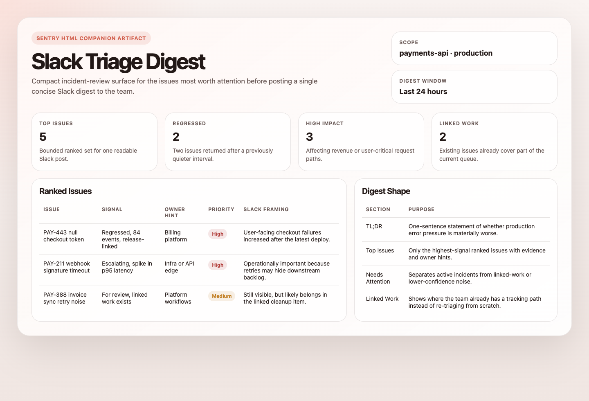
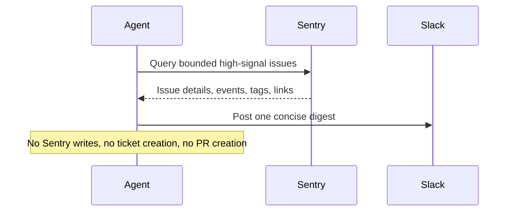

# Sentry Slack Triage Digest

## Overview

This automation reviews recent high-signal Sentry issues and posts a concise digest to Slack for engineering or on-call review. It is for keeping teams aligned on what matters now.
## Preview



## How It Works

1. Queries Sentry for high-signal issues such as regressed, escalating, for-review, or high-priority unresolved issues.
2. Expands each candidate with recommended event context, impact, linked work, and owner hints.
3. Ranks the top issues, redacts sensitive fields, and turns them into a compact Slack digest.
4. Posts one message to Slack or renders a preview if Slack delivery is unavailable.



## Prerequisites

- Sentry access through MCP or [`sentry-cli`](#cli-alternative)
- A Slack delivery tool or incoming webhook
- A defined Sentry organization, project, and environment scope

## Cursor Cloud Usage

1. Open [Cursor Automations](https://cursor.com/automations/new).
2. Name your automation and paste [sentry-slack-triage-digest.md](/Users/adamchmara/projects/ai-agent-automations/automations/sentry-slack-triage-digest/sentry-slack-triage-digest.md) as the automation prompt.
3. Add trigger conditions.
4. Click `Add tools or MCP` > `MCP server`.
5. Add the hosted Sentry MCP server at `https://mcp.sentry.dev/mcp` and complete the connection flow.
  - CLI alternative: use [`sentry-cli`](#cli-alternative) in the agent environment instead of steps 4-5.
6. Add Slack posting capability through a Slack tool, bot token, or incoming webhook secret.
7. Click `Create`.

## Codex App Usage

1. Install the hosted Sentry MCP server in Codex:
  ```bash
  codex mcp add sentry --url https://mcp.sentry.dev/mcp
  codex mcp login sentry
  codex mcp list
  ```
  - CLI alternative: use [`sentry-cli`](#cli-alternative) in the agent environment instead of MCP.
2. Click `Automation` > `New Automation`.
3. Name your automation and paste [sentry-slack-triage-digest.md](/Users/adamchmara/projects/ai-agent-automations/automations/sentry-slack-triage-digest/sentry-slack-triage-digest.md) as the automation prompt.
4. Add Slack posting capability through a connector, Slack tool, bot token, or incoming webhook.
5. Set schedule or run manually and save the automation.

## Claude Code Usage

1. Add the hosted Sentry MCP server in Claude Code:
  ```bash
  claude mcp add --transport http sentry https://mcp.sentry.dev/mcp
  claude mcp list
  ```
  - To share the MCP configuration through the repo, use `--scope project`.
  - CLI alternative: use [`sentry-cli`](#cli-alternative) in the agent environment instead of MCP.
2. Open Claude Code and run `/mcp` to authenticate with Sentry in your browser.
3. Make sure the runtime can post to Slack through a bot token or incoming webhook.
4. For repeated checks in an open Claude Code session, use `/loop`, for example:

```text
/loop weekdays at 9am Follow the instructions in automations/sentry-slack-triage-digest/sentry-slack-triage-digest.md
```

5. For durable Claude-managed automation that survives outside the current session, use `/schedule` or create a Routine in `claude.ai/code/routines`.

## CLI Alternative

If you prefer not to use MCP, `sentry-cli` is a strong portable fallback for this automation.

Install and authenticate it first:

```bash
brew install getsentry/tools/sentry-cli
sentry-cli login
```

Useful examples:

```bash
sentry issue list <org>/<project> --query "is:unresolved issue.priority:high" --json
sentry issue view <issue-id> --json
sentry issue events <issue-id> --json
```

If you use this path, make sure the agent runtime can authenticate with `sentry-cli` and that the token has the issue and event scopes you need.

## Recommended Defaults

| Setting | Default |
| --- | --- |
| Query window | `24h` |
| Candidate pool size | `20` |
| Max issues in digest | `5` |
| Signals | `is:regressed`, `is:escalating`, `issue.priority:high`, `is:unresolved is:for_review` |
| Slack delivery | `Slack tool` |
| Empty digest mode | `no-post` |
| Cooldown | `24h per unchanged issue` |

Keep the run conservative: start with preview-only until the Slack destination is trusted, surface existing Linear/Jira/PR links when they exist, and keep the digest short enough to scan in-channel.

## Prompt Inputs

Add context only when Sentry state alone is not enough, for example:

```text
Organization: acme
Projects: api, web
Environments: production
Channel: #eng-sentry-triage
If a Sentry issue already links to Linear, Jira, or a GitHub PR, surface that link and treat it as tracked work.
```

## Docs

- [Sentry MCP](https://mcp.sentry.dev)
- [Sentry CLI Installation](https://docs.sentry.dev/cli/installation/)
- [Codex Automations](https://openai.com/academy/codex-automations)
