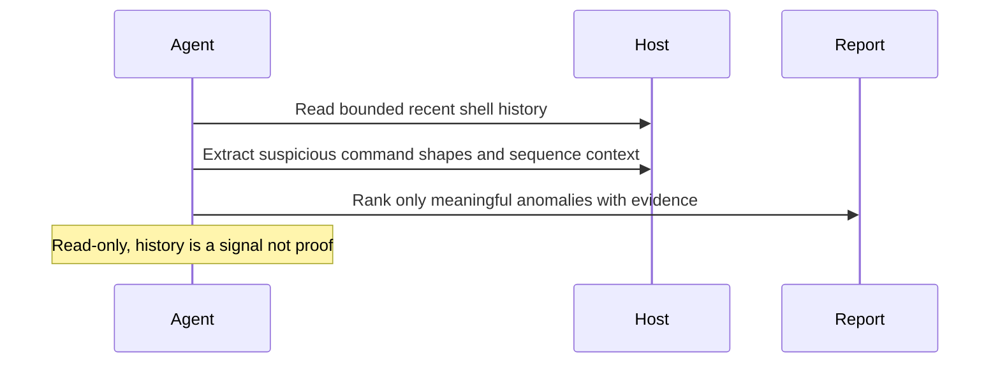

# Shell History Anomaly Digest

## Overview

This automation reviews shell history for commands or patterns that look unusual, sensitive, or security-relevant. It gives a short report for human follow-up.
## How It Works

1. Detects readable shell history sources such as `zsh`, `bash`, or `fish` history files.
2. Builds a bounded recent slice, preferring the last 24 hours when timestamps are available and bounded tail samples when they are not.
3. Extracts high-signal command patterns and adjacent sequence context.
4. Returns a short digest with ranked findings, observations, and explicit coverage gaps.



## When To Use It

- you want a daily or on-demand review of recent shell activity on one host
- you want fast triage for suspicious command patterns without broader host scanning
- you want the report to distinguish routine admin or developer work from higher-priority review items

Do not use it for full incident response, broader host forensics, or automatic history cleanup.

## Prerequisites

- The automation must run on the machine being inspected, or in an environment that can read that machine's shell history files
- Read access to local shell history files
- Standard shell tools such as `rg`, `awk`, `sed`, and `stat`
- Optional timestamp-preserving history formats such as extended `zsh` history

If no readable shell history source exists, the automation should stop instead of guessing from unrelated logs or config files.

## Cursor Cloud Usage

1. Open [Cursor Automations](https://cursor.com/automations/new).
2. Name your automation and paste [shell-history-anomaly-digest.md](/Users/adamchmara/projects/ai-agent-automations/automations/shell-history-anomaly-digest/shell-history-anomaly-digest.md) as the automation prompt.
3. Make sure the runner is attached to the host you want to inspect. A generic hosted sandbox will inspect itself, not your laptop or server.
4. No MCP setup is required. Make sure the runtime can read local history files and run standard shell tools.
5. Set the schedule or run manually, then save the automation.

## Codex App Usage

1. Click `Automation` > `New Automation`.
2. Name your automation and paste [shell-history-anomaly-digest.md](/Users/adamchmara/projects/ai-agent-automations/automations/shell-history-anomaly-digest/shell-history-anomaly-digest.md) as the automation prompt.
3. Run it only in a Codex environment that has shell access to the machine you want to inspect.
4. No MCP setup is required. Make sure the runtime can read local shell history files.
5. Set the schedule or run manually and save the automation.

## Claude Code / Codex CLI / Copilot Usage

1. No extra MCP setup is required for the core workflow.
2. Start the agent session on the host you want to inspect, or in a remote shell environment that can read that host's local shell history files.
3. For repeated checks in an open Claude Code session, use `/loop`, for example:

```text
/loop 1d Follow the instructions in automations/shell-history-anomaly-digest/shell-history-anomaly-digest.md
```

4. For durable Claude-managed automation, use `/schedule` or create a Routine in `claude.ai/code/routines`.
5. In Codex CLI or Copilot coding-agent environments, schedule this only if the runtime stays attached to the target host between runs.

## Recommended Defaults

| Setting | Default |
| --- | --- |
| Host scope | `current machine only` |
| History scope | `readable zsh, bash, and fish history files` |
| Review window | `last 24 hours or the most recent 1000 timestamped entries per file, otherwise a bounded tail sample of roughly 200 to 500 entries per untimestamped file` |
| Findings | `up to 10 retained findings` |
| Classification | `likely benign admin or dev activity`, `worth review`, `high-priority review`, `uncertain due to missing context` |
| Mutation policy | `report only` |
| Output | `Markdown report` |

Keep the run conservative: prefer sequence-level context over isolated fragments, prefer timestamped history when available, suppress routine admin and developer workflows, and redact obvious secrets or long encoded blobs in the final report.

## Prompt Inputs

Add context only when the host’s normal activity would otherwise look suspicious, for example:

```text
Expected shell activity includes Docker, kubectl, Terraform, AWS CLI, and SSH administration.
This is a development laptop. Routine package-manager, git, build, test, and local database commands should not become ranked findings by themselves.
If you find history-clearing commands, suspicious SSH key edits, or download-and-execute chains, include one concrete manual follow-up command or file path.
```

## Docs

- [Codex Automations](https://openai.com/academy/codex-automations)
