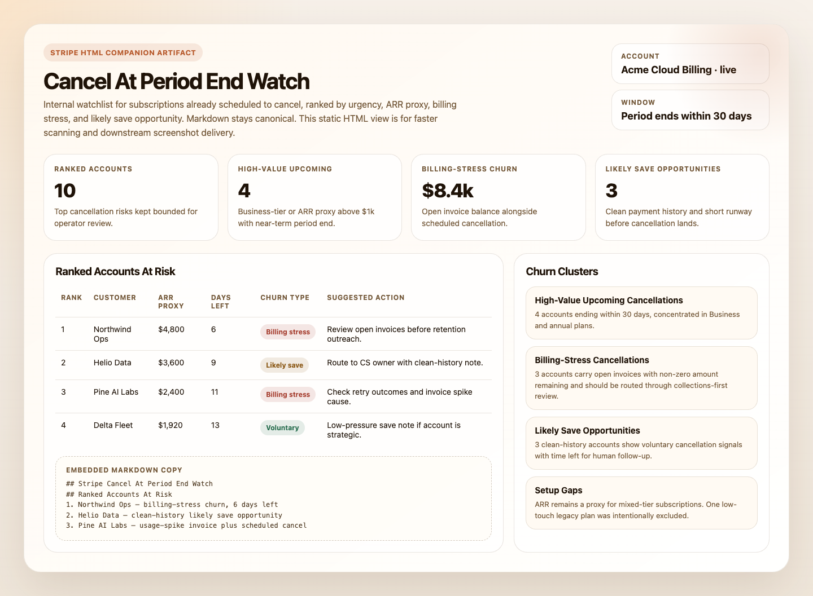
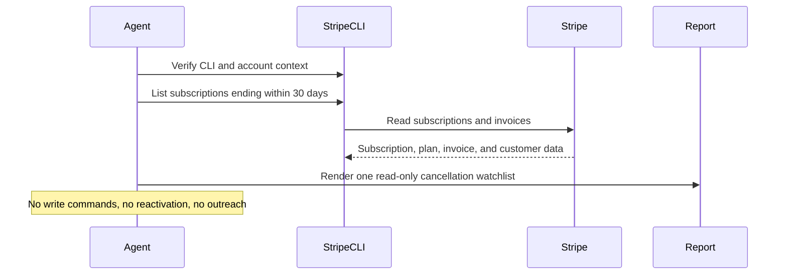

# Stripe Cancel At Period End Watch

## Overview

This automation reviews Stripe subscriptions set to cancel at period end and ranks the ones most worth a save or follow-up. It helps teams focus on the highest-value cancellations.
## Preview



## How It Works

1. Verifies Stripe CLI is installed and authenticated against the intended account.
2. Confirms account identity and the intended live or test mode with `stripe whoami` and `stripe get /v1/account`.
3. Lists subscriptions whose `current_period_end` falls within the next 30 days, then filters `cancel_at_period_end=true` locally.
4. Pages through that window conservatively so the run stays bounded.
5. Enriches the highest-priority candidates with recent invoice history to separate billing-stress churn from cleaner voluntary churn.
6. Produces one concise internal digest with ranked accounts, likely save opportunities, skipped items, and setup gaps.
7. When the runtime can write files, it can also save a static HTML companion report.



## Prerequisites

- Stripe CLI installed and authenticated against the target account
- Verify the runtime with:

```bash
stripe --version
stripe whoami
```

- One explicit Stripe mode per run if both live and test credentials are available
- Optional delivery tooling if you want the digest posted somewhere other than the run output

## CLI Setup

```bash
brew install stripe/stripe-cli/stripe
stripe login
```

Keep the workflow read-only and use restricted credentials where possible.

## Cursor Cloud Usage

1. Open [Cursor Automations](https://cursor.com/automations/new).
2. Name your automation and paste [stripe-cancel-at-period-end-watch.md](/Users/adamchmara/projects/ai-agent-automations/automations/stripe-cancel-at-period-end-watch/stripe-cancel-at-period-end-watch.md) as the automation prompt.
3. Make sure Stripe CLI is installed in the runner and authenticated to the intended account before the automation starts.
4. Add Slack, GitHub, or email delivery only if you want the digest posted somewhere else.
5. Start with preview-only delivery, then add a daily or twice-weekly schedule.

## Codex App Usage

1. Make sure Stripe CLI is installed in the runtime and authenticated to the intended account.
2. Verify the runtime before scheduling:

```bash
stripe --version
stripe whoami
stripe get /v1/account
```

3. Click `Automation` > `New Automation`.
4. Paste [stripe-cancel-at-period-end-watch.md](/Users/adamchmara/projects/ai-agent-automations/automations/stripe-cancel-at-period-end-watch/stripe-cancel-at-period-end-watch.md) as the automation prompt.
5. Add delivery tools only if needed, keep them separate from Stripe CLI auth, and start in preview mode.
6. Set a schedule or run manually.

## Claude Code / Codex CLI / Copilot Usage

1. Make sure Stripe CLI is installed and authenticated in the runtime before running the prompt.
2. Keep this automation internal and report-only. If someone wants retention outreach or offer creation, route that into a separate approved workflow.
3. For repeated checks in an open Claude Code session, use `/loop`, for example:

```text
/loop weekdays at 9am Follow the instructions in automations/stripe-cancel-at-period-end-watch/stripe-cancel-at-period-end-watch.md
```

4. If you add Slack or GitHub delivery, start with preview output.

## Recommended Defaults

| Setting | Default |
| --- | --- |
| Cadence | `daily` |
| Subscription query | `status=all, current_period_end within next 30 days, expand subscription items, then local filter on cancel_at_period_end=true` |
| Primary window | `period ends within 30 days` |
| Enrichment cap | `up to 10 customers with recent invoice history` |
| Final digest size | `up to 10 ranked accounts` |
| ARR source | `derived from plan.amount on subscription items, labeled estimate for tiered pricing` |
| Scope | `one Stripe account and one explicit Stripe mode per run` |
| Output mode | `internal report-only / preview-first, with optional HTML artifact when writable` |
| Customer identifiers | `customer name and email allowed for approved internal delivery` |

Keep the run conservative: require one explicit mode per run, filter `cancel_at_period_end=true` locally after the supported period-end query, treat open invoice balance as billing-stress churn, and never turn this into a customer-message or reactivation workflow.

## Prompt Inputs

Add context only when the automation should treat some accounts or churn types differently, for example:

```text
Do not flag sandbox customers, internal accounts, or legacy low-touch plans as likely save opportunities.
If a scheduled cancellation also has open invoices, classify it as billing-stress churn.
If an open invoice materially exceeds prior paid invoices, flag it as a usage spike.
```

## Docs

- [Stripe CLI](https://docs.stripe.com/stripe-cli)
- [Stripe Subscriptions](https://docs.stripe.com/billing/subscriptions/overview)
- [Codex Automations](https://openai.com/academy/codex-automations)
