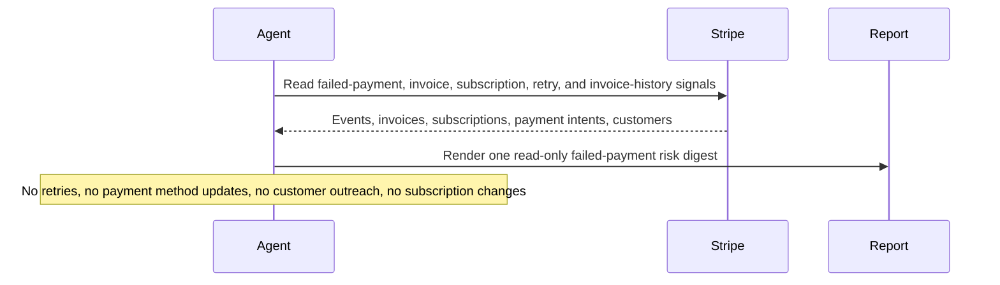

# Stripe Failed Payment Risk Digest

## Overview

This automation reviews recent Stripe payment failures and highlights the customers most likely to turn into involuntary churn, delayed cash collection, or support escalations. It helps revenue teams focus on the riskiest cases first.
## Preview


## How It Works

1. Connects to Stripe, confirms the account, and determines the intended mode.
2. Pulls a bounded candidate set for failed invoices, payment intents, and past_due, unpaid, or incomplete subscriptions.
3. Enriches the highest-priority customers with recent invoice history so the digest can use real outstanding balance and prior paid amounts.
4. Flags usage spikes separately from ordinary failed collections and produces one concise internal digest with ranked risk, recovery actions, and setup gaps.
5. When the runtime can write files, it can also save a static HTML companion report.



## Prerequisites

- Stripe access through the hosted MCP server, a local `@stripe/mcp` server, or authenticated Stripe CLI access
- Read access to invoices, subscriptions, payment intents, customers, prices, and recent relevant events
- Optional delivery tooling if you want the digest posted somewhere other than the run output
- Optional knowledge of current recovery policy if you want more specific recovery actions

## CLI Setup

```bash
brew install stripe/stripe-cli/stripe
stripe login
```

Use restricted credentials where possible and keep the workflow read-only.

## Cursor Cloud Usage

1. Open [Cursor Automations](https://cursor.com/automations/new).
2. Name your automation and paste [stripe-failed-payment-risk-digest.md](/Users/adamchmara/projects/ai-agent-automations/automations/stripe-failed-payment-risk-digest/stripe-failed-payment-risk-digest.md) as the automation prompt.
3. Add the official Stripe plugin from the Cursor marketplace and complete the connection flow there.
4. If you prefer CLI access instead of the plugin, make sure authenticated Stripe CLI reads are available.
5. Add Slack, GitHub, or email delivery only if you want the digest posted somewhere else.
6. Start with preview-only delivery, then add a daily schedule.

## Codex App Usage

1. Add Stripe MCP to Codex.

```bash
codex mcp add stripe --url https://mcp.stripe.com
codex mcp login stripe
codex mcp list
```

2. If you prefer a key-based local runtime instead of hosted OAuth, run the local Stripe MCP server with a restricted key and add that server to Codex instead of the hosted URL.
3. Click `Automation` > `New Automation`.
4. Name your automation and paste [stripe-failed-payment-risk-digest.md](/Users/adamchmara/projects/ai-agent-automations/automations/stripe-failed-payment-risk-digest/stripe-failed-payment-risk-digest.md) as the automation prompt.
5. Optionally add Slack, GitHub, or email delivery tools, but keep them separate from Stripe auth and start in preview mode.
6. Set a schedule or run manually and save the automation.

## Claude Code / Codex CLI / Copilot Usage

1. Make sure the runtime has Stripe access through the hosted MCP server or a local `@stripe/mcp` process backed by a restricted key.
2. Keep this automation internal and report-only. If someone wants customer outreach, route that into a separate approved draft-first workflow.
3. For repeated checks in an open Claude Code session, use `/loop`, for example:

```text
/loop weekdays at 9am Follow the instructions in automations/stripe-failed-payment-risk-digest/stripe-failed-payment-risk-digest.md
```

4. In Codex CLI or Copilot-style environments, use Stripe CLI as a helper if MCP is not the main runtime path.
5. If you add Slack or GitHub delivery, start with preview output before allowing routine posting.

## Recommended Defaults

| Setting | Default |
| --- | --- |
| Cadence | `daily` |
| Query window | `previous completed 24h` |
| Candidate pool | `up to 30 payment intents or invoices, plus up to 10 subscriptions per risk status` |
| Enrichment cap | `up to 10 customers with recent invoice history` |
| Final digest size | `up to 10 ranked customers or accounts` |
| Amount-at-risk source | `summed amount_remaining across open invoices when invoice data is available` |
| Scope | `one Stripe account per run` |
| Output mode | `internal report-only / preview-first, with optional HTML artifact when writable` |
| Customer identifiers | `customer name and email allowed for approved internal delivery` |

Keep the report practical: prefer current Stripe object state over raw events, use summed `amount_remaining` when invoice history is available, separate usage spikes from ordinary collections work, and never turn this into a customer-message or billing-mutation workflow.

## Prompt Inputs

Add context only when your recovery policy or thresholds are not obvious from Stripe state, for example:

```text
Run against the live SaaS billing account only.
Treat any single failed invoice above 1000, any customer with more than 2 consecutive open invoices, or any past_due annual subscription as high priority.
If the next payment attempt is already scheduled, prefer monitoring over immediate intervention unless the account is high value.
If an open invoice is materially above the customer's recent paid invoices, treat it as a usage spike.
```

## Docs

- [Stripe MCP](https://docs.stripe.com/agents)
- [Stripe CLI](https://docs.stripe.com/stripe-cli)
- [Codex Automations](https://openai.com/academy/codex-automations)
