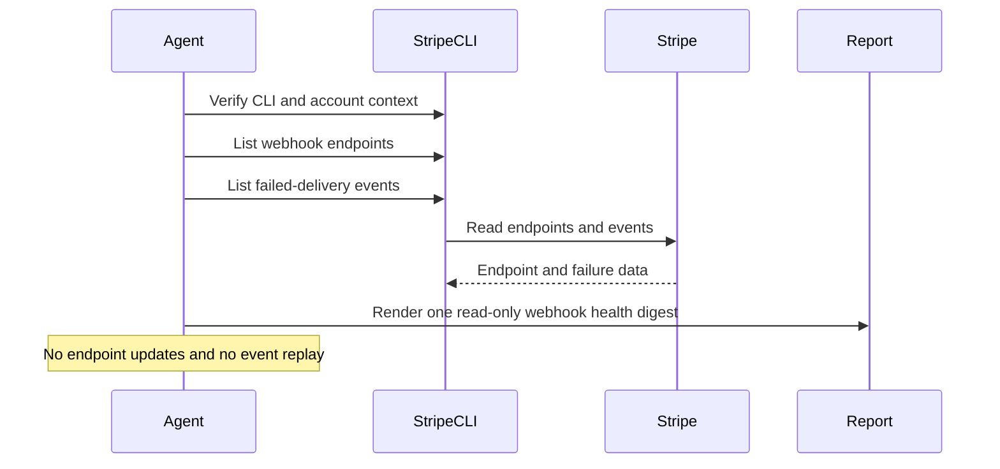

# Stripe Webhook Health Watch

## Overview

This automation reviews production Stripe webhook delivery health and highlights failed deliveries, noisy endpoints, or setup problems. It helps teams catch billing or integration issues early.
## Preview


## How It Works

1. Verifies that Stripe CLI is installed and authenticated for live-mode reads.
2. Lists up to 20 live webhook endpoints and separates production endpoints from local, staging, dev, and temporary tunnel targets.
3. Lists up to 100 live failed-delivery events and extracts the highest-signal failure evidence.
4. Attributes failures to one production endpoint only when the CLI evidence is strong enough. Otherwise it reports the issue at the account level instead of pretending to know the exact receiver.
5. Produces one ranked internal digest with production endpoint inventory, findings, ignored non-production endpoint summary, grouped hygiene notes, detailed endpoint notes only where useful, skipped items, and setup gaps.



## When To Use It

- Stripe webhooks feed production systems such as fulfillment, billing sync, or entitlement sync
- you want early warning that live events may be missing or routed incorrectly
- your team wants one concise health digest rather than raw event inspection

## Prerequisites

- Stripe CLI installed and authenticated for live-mode reads
- Verify the runtime with:

```bash
stripe --version
stripe webhook_endpoints list --live --limit=1
stripe events list --live --limit=1
```

- Optional delivery tooling if you want the digest posted somewhere other than the run output

This automation is intentionally live-only. It should stop instead of falling back to test mode.

## CLI Setup

```bash
brew install stripe/stripe-cli/stripe
stripe login
```

Use restricted credentials where possible and keep the workflow read-only.

## Cursor Cloud Usage

1. Open [Cursor Automations](https://cursor.com/automations/new).
2. Name your automation and paste [stripe-webhook-health-watch.md](/Users/adamchmara/projects/ai-agent-automations/automations/stripe-webhook-health-watch/stripe-webhook-health-watch.md) as the automation prompt.
3. Make sure Stripe CLI is installed in the runner and authenticated for live-mode reads before the automation starts.
4. Add Slack, GitHub, or email delivery only if you want the digest posted somewhere other than the run output.
5. Start with preview-only delivery, then move to an hourly, every-6-hours, or daily schedule based on webhook volume.

## Codex App Usage

1. Make sure Stripe CLI is installed in the runtime and authenticated to the intended account.
2. Verify the runtime before scheduling:

```bash
stripe --version
stripe webhook_endpoints list --live --limit=1
stripe events list --live --limit=1
```

3. Click `Automation` > `New Automation`.
4. Paste [stripe-webhook-health-watch.md](/Users/adamchmara/projects/ai-agent-automations/automations/stripe-webhook-health-watch/stripe-webhook-health-watch.md) as the automation prompt.
5. Add delivery tools only if needed, keep them separate from Stripe CLI auth, and start in preview mode.
6. Set a schedule or run manually.

## Claude Code / Codex CLI / Copilot Usage

1. Make sure Stripe CLI is installed and authenticated in the runtime before running the prompt.
2. Keep this automation internal and report-only. If someone wants endpoint repair, retry handling, or customer-facing remediation, route that into separate approved workflows.
3. For repeated checks in an open Claude Code session, use `/loop`, for example:

```text
/loop every 6 hours Follow the instructions in automations/stripe-webhook-health-watch/stripe-webhook-health-watch.md
```

4. If you add Slack or GitHub delivery, start with preview output.

## Recommended Defaults

| Setting | Default |
| --- | --- |
| Cadence | `every 6 hours` |
| Endpoint query | `stripe webhook_endpoints list --live --limit=20` |
| Failed-event query | `stripe events list --live --delivery-success=false --limit=100` |
| Findings cap | `up to 10 ranked findings` |
| Scope | `one Stripe account in live mode per run` |
| Output mode | `internal report-only / preview-first` |
| Endpoint attribution | `direct when available, otherwise clearly labeled inference` |

Keep the run conservative: stay live-only, ignore non-production endpoints unless they affect live traffic, treat live endpoints that point to staging or localhost as urgent misconfiguration, and never turn this into a resend or endpoint-editing workflow.

## Prompt Inputs

Add context only when the automation needs help distinguishing production targets or event criticality, for example:

```text
Treat checkout.session.completed, invoice.paid, invoice.payment_failed, customer.subscription.updated, and charge.dispute.created as operationally critical.
Treat only api.novu.co and eu.api.novu.co as production webhook targets.
Post only CRITICAL and HIGH findings to Slack.
```

## Docs

- [Stripe CLI](https://docs.stripe.com/stripe-cli)
- [Stripe Webhooks](https://docs.stripe.com/webhooks)
- [Codex Automations](https://openai.com/academy/codex-automations)
